### File SDD

Mục lục

I. Giới thiệu Tú

    1.1 Mục đích tài liệu
    1.2 Phạm vi tài liệu
    1.3 Thuật ngữ và các từ viết tắt
    1.4 Tài liệu tham khảo
    1.5 Mô tả tài liệu

II. Khảo sát hiện trạng phần mềm Vinh

    2.1 Khảo sát hiện trạng
    	2.2 Mục tiêu tổng quát

2.3 Mục tiêu cụ thể
2.4 Phạm vi dự án
Khu vực triển khai
Đối tượng người dùng
Chức năng chính
Hạn chế
ĐỊnh hướng mở rộng

III. Thiết kế hệ thống phần mềm

Vinh

    3.1 Biểu đồ usecase
    	3.2 Biểu đồ activity
    	3.3 Biểu đồ class

Tú

    3.4 Biểu đồ sequence

3.5 Biểu đồ component

IV. Thiết kế dữ liệu Tú

    4.1 Mô tả dữ liệu
    	4.2 Biểu đồ ER
    	4.3 Thiết kế dữ liệu
        
V. Thiết kế giao diện

    (Giao diện các trang)
---

## I. GIỚI THIỆU (Tú)

### 1.1 Mục đích tài liệu
Tài liệu Mô tả Thiết kế Phần mềm (Software Design Description - SDD) này được xây dựng mang tính chiến lược, nhằm cung cấp một cái nhìn toàn diện, sâu sắc và có tổ chức chặt chẽ về toàn bộ quá trình hiện thực hóa giải pháp kỹ thuật cho dự án **MusicHub - Hệ thống Giải trí Âm nhạc Trực tuyến**. Trong kỷ nguyên số, nơi mà trải nghiệm âm nhạc trực tuyến đòi hỏi sự mượt mà tuyệt đối và tính cá nhân hóa cao, tài liệu này đóng vai trò là "hiến pháp kỹ thuật", là kim chỉ nam dẫn đường cho đội ngũ phát triển xuyên suốt từ giai đoạn sơ khởi cho đến khi vận hành thực tế. Bản thiết kế này đảm bảo rằng mọi thành viên trong dự án, dù ở vị trí nào, cũng đều sở hữu một bức tranh chung và đồng nhất về mục tiêu, kiến trúc và các tiêu chuẩn kỹ thuật cần đạt được.

Nội dung của tài liệu không đơn thuần chỉ là một tập hợp các sơ đồ UML khô khan hay những bảng biểu dữ liệu tĩnh, mà là một "hành trình" kể lại câu chuyện về cách một sản phẩm công nghệ âm nhạc được thai nghén và hình thành. Từng dòng mô tả, từng luồng chức năng đều được viết với tâm thế giữ chân người đọc, truyền cảm hứng và xây dựng niềm tin vững chắc vào chất lượng của hệ thống. Tài liệu này là cầu nối sống động giữa các yêu cầu nghiệp vụ trừu tượng (SRS) và mã nguồn thực thi, giúp lập trình viên hiểu rõ "linh hồn" của từng module chức năng, giúp kiểm thử viên xác lập được các kịch bản chuẩn xác, và giúp nhà quản lý kiểm soát được tiến độ cũng như rủi ro kỹ thuật. Việc thiết kế đúng và chi tiết ngay từ đầu không chỉ là một yêu cầu kỹ thuật mà còn là yếu tố sống còn để giảm thiểu lãng phí và đảm bảo khả năng bảo trì bền vững cho hệ thống.

Đặc biệt đối với một nền tảng giải trí cộng đồng như MusicHub – nơi người dùng tìm kiếm sự thư giãn và kết nối cảm xúc thông qua âm nhạc – thì việc thiết kế hệ thống phải đạt đến độ tinh tế và chuẩn xác cao. Tài liệu này chính là cam kết của nhóm phát triển về một hệ thống được lập quy chuẩn bài bản, sẵn sàng đối mặt với các thách thức về băng thông, lưu trữ và bảo mật thông tin trong môi trường trực tuyến phức tạp.

### 1.2 Phạm vi tài liệu
Tài liệu thiết kế này được coi là xương sống cho toàn bộ quá trình phát triển ứng dụng MusicHub, đóng vai trò bản vẽ đặc tả kỹ thuật tối thượng phục vụ cho việc thi công và lắp ráp các thành phần phần mềm. Vượt xa khỏi những mô tả tính năng bề nổi, phạm vi của tài liệu này đi sâu vào việc phẫu thuật các kiến trúc nền tảng, tạo ra sự gắn kết hữu cơ giữa ý tưởng sáng tạo UI/UX và các thuật toán xử lý dữ liệu phức tạp ở phía sau. Phạm vi bao quát của tài liệu tập trung vào các trụ cột trọng tâm do Tú phụ trách thiết kế:

1.  **Thiết kế Hành vi và Tương tác (Behavioral Design)**: Tài liệu sẽ chi tiết hóa các luồng tương tác tuần tự giữa người dùng và các thực thể hệ thống. Thông qua các sơ đồ Sequence, chúng ta sẽ mô hình hóa các quy trình nghiệp vụ nhạy cảm như Xác thực người dùng thông qua mã băm, quy trình đóng gói và truyền tải luồng âm thanh kỹ thuật số (Streaming Flow), và đặc biệt là quy trình kiểm soát nội dung do cộng đồng đóng góp (UGC) – đảm bảo mọi tệp tin được upload đều đi đúng quy trình kiểm duyệt an toàn.
2.  **Thiết kế Kiến trúc Thành phần (Architectural Composition)**: Phân tách hệ thống thành các module logic độc lập nhưng có mối liên kết chặt chẽ. Tài liệu làm rõ cơ chế Orchestration giữa tầng giao diện ứng dụng trang đơn (SPA) chuẩn ReactJS, tầng logic nghiệp vụ chuẩn RESTful API của Django, và hạ tầng lưu trữ đám mây đặc thù cho tệp Media (Cloudinary). Điều này đảm bảo tính modular hóa, giúp hệ thống dễ dàng thay thế hoặc nâng cấp từng phần mà không ảnh hưởng đến cấu trúc tổng thể.
3.  **Thiết kế Cơ sở Dữ liệu và Lưu trữ (Data & Storage Design)**: Tập trung vào việc xây dựng mô hình dữ liệu quan hệ (ERD) đạt chuẩn 3NF, tối ưu hóa quá trình truy vấn metadata âm nhạc. Phạm vi này bao gồm việc định nghĩa chi tiết các kiểu dữ liệu, ràng buộc khóa ngoại và chiến lược index, đảm bảo hệ thống có thể xử lý đồng thời hàng ngàn yêu cầu truy cập và quản lý kho nhạc khổng lồ một cách hiệu quả và tin cậy.

Ngoài ra, tài liệu còn là công cụ giúp duy trì sự đồng bộ tuyệt đối trong nhóm phát triển. Đây là điểm tựa để phân công công việc chính xác đến từng module, là thước đo để kiểm tra sự tuân thủ các cam kết kỹ thuật ban đầu và là tài sản tri thức vô giá khi hệ thống cần mở rộng sang các giai đoạn tiếp theo (như tích hợp AI gợi ý nhạc hoặc thanh toán trực tuyến).

### 1.3 Thuật ngữ và các từ viết tắt
Để đảm bảo sự thống nhất tuyệt đối trong cách hiểu và truyền đạt thông tin giữa các thành viên trong nhóm cũng như với các đối tác liên quan, phần này liệt kê và giải nghĩa chi tiết các thuật ngữ, từ viết tắt và các khái niệm kỹ thuật cốt lõi xuất hiện xuyên suốt trong tài liệu. Bảng thuật ngữ này đóng vai trò như một "từ điển kỹ thuật" nội bộ, giúp xóa bỏ mọi rào cản về ngôn ngữ giữa các bộ phận khác nhau trong dự án:

| Thuật ngữ | Định nghĩa | Ý nghĩa và Giải thích trong hệ thống |
| :--- | :--- | :--- |
| **SDD** | Software Design Description | Bản thiết kế kỹ thuật chi tiết, là cơ sở để triển khai mã nguồn. |
| **SRS** | Software Requirements Specification | Tài liệu đặc tả yêu cầu, là đầu vào định hình nên bản thiết kế SDD. |
| **API** | Application Programming Interface | "Cổng giao tiếp" để các thành phần phần mềm trao đổi dữ liệu an toàn. |
| **JWT** | JSON Web Token | Một phương thức xác thực bằng Token mã hóa, giúp bảo mật phiên làm việc. |
| **SPA** | Single Page Application | Ứng dụng web chỉ tải trang một lần, mang lại trải nghiệm mượt mà không tải lại. |
| **ORM** | Object-Relational Mapping | Công cụ giúp lập trình viên thao tác với Database thông qua đối tượng lập trình. |
| **UGC** | User-Generated Content | Nội dung do người dùng đóng góp, là xương sống của cộng đồng MusicHub. |
| **DRF** | Django REST Framework | Bộ công cụ mạnh mẽ dùng để xây dựng các Web API chuẩn RESTful phía Backend. |
| **Cloudinary** | Media Management SaaS | Dịch vụ đám mây chuyên dụng để tối ưu hóa, lưu trữ và truyền tải tệp âm nhạc. |
| **Middleware** | Phần mềm trung gian | Các lớp xử lý logic xen giữa luồng Request/Response để kiểm tra bảo mật. |
| **Scalability** | Khả năng mở rộng | Khả năng hệ thống thích ứng và phát triển khi số lượng người dùng tăng đột biến. |
| **Latency** | Độ trễ | Chỉ số đo lường thời gian phản hồi, mục tiêu hệ thống là tối thiểu hóa độ trễ. |
| **Stateless** | Không trạng thái | Cơ chế không lưu giữ trạng thái phiên ở Server để tăng hiệu suất xử lý API. |

### 1.4 Tài liệu tham khảo
Trong hành trình xây dựng bản thiết kế cho dự án MusicHub, chúng tôi đã tham khảo và áp dụng các tiêu chuẩn công nghiệp và các tài liệu chuyên ngành đáng tin cậy. Việc này không chỉ giúp thiết kế tuân theo các quy chuẩn quốc tế mà còn đảm bảo hệ thống có khả năng tương thích cao và bền vững theo thời gian. Các tài liệu này là nền móng tri thức để nhóm xác định cấu trúc tài liệu, định hướng kiến trúc Micro-services (hướng dịch vụ) và các tiêu chuẩn bảo mật cho dòng dữ liệu âm thanh:

- **IEEE Std 1016-1998 & 2009**: Tiêu chuẩn vàng quốc tế về tổ chức nội dung và cấu trúc cho tài liệu thiết kế phần mềm chuyên nghiệp.
- **Django REST Framework Architecture Guide**: Tài liệu hướng dẫn thiết kế kiến trúc API linh hoạt, an toàn và dễ mở rộng.
- **ReactJS Component Design Patterns**: Các mô hình thiết kế giao diện React giúp tối ưu hóa việc tái sử dụng code và quản lý trạng thái.
- **OWASP Application Security Verification Standard**: Quy chuẩn xác thực bảo mật ứng dụng nhằm bảo vệ dữ liệu người dùng và sở hữu trí tuệ âm nhạc.
- **Standard Research on Music Streaming UX**: Các nghiên cứu về trải nghiệm người dùng trên các nền tảng âm nhạc lớn như Spotify, Tinder (cho luồng tương tác vuốt chọn) để rút ra các bộ khung UX tiêu chuẩn.

### 1.5 Mô tả tài liệu
Tài liệu được cấu trúc hóa một cách khoa học thành các chương mục liên kết chặt chẽ, dẫn dắt độc giả đi từ những khái niệm tổng quát nhất đến những chi tiết kỹ thuật sâu sắc nhất. Cách bố trí này giúp người đọc dễ dàng định vị thông tin và nắm bắt được luồng logic của toàn bộ hệ thống:

- **Chương I**: Nhập môn, xác định mục tiêu và quy chuẩn của bản thiết kế.
- **Chương II**: (Vinh phụ trách) Khảo sát hiện trạng và mục tiêu dự án.
- **Chương III**: Thiết kế hệ thống phần mềm (Vinh làm 3.1-3.3, Tú làm 3.4-3.5).
- **Chương IV**: (Tú phụ trách) Thiết kế hạ tầng dữ liệu và lưu trữ.
- **Các phụ lục**: Ghi chú thay đổi và tài liệu bổ trợ.

---

## II. Khảo sát hiện trạng phần mềm Vinh

### 2.1 Khảo sát hiện trạng

Trong bối cảnh bùng nổ của thời đại số hóa, nhu cầu giải trí và thưởng thức âm nhạc trực tuyến mọi lúc, mọi nơi của con người ngày càng trở nên thiết yếu. Để dự án Website Nghe Nhạc Trực Tuyến có thể bám sát được thực tiễn và đáp ứng tốt nhất nhu cầu của người dùng, nhóm phát triển đã tiến hành khảo sát, phân tích hiện trạng các nền tảng âm nhạc đang tồn tại trên thị trường:

**1. Hiện trạng thị trường và các ứng dụng có sẵn:**

- Hiện nay, thị trường streaming nhạc có sự tham gia của nhiều nền tảng mạnh mẽ cả trong lẫn ngoài nước như _Zing MP3, NhacCuaTui, Spotify, Apple Music_ và _YouTube Music_.
- Các nền tảng này mang lại trải nghiệm tuyệt vời với kho nhạc đồ sộ cùng hệ thống thuật toán gợi ý hành vi cá nhân hóa cao.
- Tuy nhiên, phần lớn các ứng dụng đang dần thương mại hóa mạnh, yêu cầu người dùng nâng cấp lên tài khoản trả phí (VIP/Premium) để sử dụng các tiện ích cơ bản như: nghe nhạc chất lượng cao (320kbps/lossless), tải nhạc ngoại tuyến, hay phổ biến nhất là nghe nhạc không gián đoạn bởi quảng cáo. Điều này gây khó khăn tiếp cận đối với nhóm đối tượng học sinh, sinh viên hoặc những người có thu nhập thấp.

**2. Khó khăn trong việc giao lưu và chia sẻ âm nhạc từ cộng đồng (User-Generated Content):**

- Các nền tảng lớn tập trung phân phối bản quyền chính thống từ các nghệ sĩ lớn và công ty giải trí. Do đó, quy trình đưa một tác phẩm lên nền tảng thường rất khắt khe và phức tạp qua các nhà phân phối (Distributors).
- Những bản nhạc Cover, các luồng remix tự do (Nonstop/Vinahouse), hoặc hoạt động của các nghệ sĩ phòng thu độc lập (Indie/Underground) rất khó khăn để tiếp cận thính giả trực tiếp bằng chính tài khoản của họ.
- Người dùng thiếu đi một "bộ lưu trữ đám mây" chuyên biệt về âm nhạc để tự do đăng tải định dạng `.mp3` lên server và nghe chéo ở nhiều thiết bị.

**3. Hiện trạng về mặt công nghệ (Technological Context):**

- Chuyển dịch kiến trúc linh hoạt: Ở các mô hình hệ thống cũ, việc điều hướng (chuyển trang) sẽ khiến trang web tải lại (reload), làm đứt gãy luồng phát của dòng âm thanh đang duy trì. Giải quyết triệt để khuyết điểm này bằng kiến trúc Single Page Application (SPA) của các framework hiện đại như ReactJS/VueJS là một yêu cầu bắt buộc của mọi nền tảng Streaming web hiện nay.
- Quản lý băng thông (Bandwidth Management): Việc lưu trữ hàng chục ngàn file Media âm thanh có thể bòn rút và làm tê liệt server truyền thống một cách nhanh chóng. Thị trường hiện nay ưa chuộng sử dụng các kho lưu trữ đám mây bên thứ ba (như Cloudinary, AWS S3) để phân tải tệp kỹ thuật số, giảm áp lực mạng cho máy chủ nghiệp vụ nội bộ.

**=> Kết luận:**
Từ những nhận định trên, việc xây dựng một **Website nghe nhạc trực tuyến** đi theo hướng tiếp cận mở: vừa cung cấp các tiện ích cốt lõi của một Music Player mượt mà (SPA web), vừa xây dựng môi trường cho phép **cộng đồng tự do đóng góp Upload file âm thanh** (dưới sự kiểm duyệt của Admin), đi kèm mã nguồn vận hành độc lập là hoàn toàn có tính thực tiễn cao, giúp thu hút nhóm ngách người dùng có nhu cầu cá nhân hóa bộ sưu tập âm nhạc của riêng họ.

### 2.2 Mục tiêu tổng quát (General Objectives)

Dựa trên kết quả từ quá trình khảo sát hiện trạng và định vị được những "nỗi đau" (pain points) của người dùng hiện tại, nhóm phát triển đặt ra các mục tiêu tổng quát (General Objectives) cho dự án phần mềm **Website Nghe Nhạc Trực Tuyến** như sau:

**1. Xây dựng môi trường Âm nhạc mở, Miễn phí (Free-to-Use Platform):**
Phát triển một nền tảng âm nhạc có khả năng cung cấp đầy đủ các nhu cầu giải trí và tiện ích cốt lõi nhất (như nghe nhạc chất lượng cao, phát nhạc nền liên tục, tự do tạo lập Playlist) hoàn toàn miễn phí, hướng đến tệp khách hàng tiềm năng là học sinh, sinh viên.

**2. Phát triển Cộng đồng chia sẻ nội dung độc lập (User-Generated Content):**
Tạo ra một không gian tương tác mà ở đó, người dùng không chỉ đóng vai trò là "thính giả" (Listener) mà còn là "người sáng tạo" (Creator). Website sẽ cung cấp công cụ cho phép cá nhân tự do tải lên (Upload) các file audio (.mp3), chia sẻ những bản nhạc Indie, Cover, Remix độc quyền của họ đến cộng đồng một cách trực tiếp và nhanh chóng nhất.

**3. Tối ưu hóa Trải nghiệm Người dùng (UX/UI Optimization):**

- **Về mặt giao diện:** Thiết kế giao diện hiện đại, trực quan (lấy cảm hứng từ NhacCuaTui) với thao tác mượt mà, thân thiện.
- **Về mặt trải nghiệm âm thanh:** Áp dụng mô hình Single Page Application (SPA) trên Frontend để đảm bảo luồng phát nhạc (Audio Player) diễn ra liên tục, liền mạch, không bao giờ bị đứt quãng khi người dùng thao tác chuyển đổi qua lại giữa các trang.

**4. Thiết lập Hệ thống Quản trị (CMS) mạnh mẽ, an toàn:**
Vì dự án đi theo hướng mở cho phép người dùng tự tải nhạc, mục tiêu then chốt là phải trang bị cho Quản trị viên (Admin) một hệ thống bảng điều khiển (Dashboard) toàn diện. Hệ thống này phải có khả năng kiểm duyệt nội dung chờ duyệt (Pending Uploads) dễ dàng bằng công cụ nghe thử nội tuyến, nhằm loại trừ kịp thời các nội dung vi phạm bản quyền hay quy chuẩn đạo đức trước khi hòa vào kho nhạc chung.

**5. Đảm bảo Kiến trúc linh hoạt và Khả năng mở rộng (Scalability):**
Thiết kế kiến trúc hệ thống 3 lớp (3-Tier) phân tách rõ ràng giữa Logic xử lý (Backend) và Lưu trữ tĩnh (Cloud Storage chuyên biệt cho Audio/Image). Mục tiêu là hệ thống phải chịu tải tốt, tiết kiệm băng thông và dễ dàng nâng cấp (scale-up) thêm các máy chủ trong tương lai khi cộng đồng phát triển mà không phải đập bỏ mã nguồn cũ.

### 2.3 Mục tiêu cụ thể (Specific Objectives)

Để hiện thực hóa các mục tiêu tổng quát bên trên, hệ thống cần đạt được các chỉ tiêu chi tiết đo lường được trên 3 phương diện chính:

**1. Mục tiêu về Chức năng nghiệp vụ (Functional Objectives):**

- **Module Nghe Nhạc:** Hoàn thiện trình phát nội tuyến (Audio Player) với đầy đủ các tính năng điều khiển cơ bản (Phát/Dừng, Chuyển tiếp/Lùi bài, Lặp lại (Loop) thông minh, Trộn bài (Shuffle)) và chức năng hiển thị lời nhạc đồng bộ.
- **Module Tìm kiếm & Khám phá:** Cung cấp Live-search và Bảng xếp hạng. Đặc biệt, xây dựng trang **Dành cho bạn (For You)** để nhóm ngẫu nhiên hoặc đề xuất các bài hát cùng chung Thể loại/Ca sĩ dựa trên lịch sử của User.
- **Module Cá nhân hóa:** Thiết kế không gian "Tủ nhạc Góc Tui" cho phép người dùng tự do thêm mới, sửa tên Playlist riêng biệt và lưu trữ nhanh danh sách các "Bài hát yêu thích".
- **Module Đóng góp & Kiểm duyệt (UGC):** Hoàn thiện luồng quy trình: Người dùng phổ thông tạo Form đính kèm và uplaod Audio file (.mp3) -> Admin nhận tín hiệu Pending -> Quản trị viên sử dụng bảng điều khiển CMS để nghe thử nội tuyến rồi quyết định Bấm "Duyệt" (Public) hoặc "Từ chối" (Reject).

**2. Mục tiêu về Chỉ tiêu Kỹ thuật (Technical & Security Objectives):**

- **Kiến trúc SPA:** Thiết lập Frontend chuẩn **ReactJS** để kiểm soát Global State, giúp quá trình chuyển hướng trang URL (Routing) hoàn toàn vô hình, ngăn chặn tuyệt đối tình trạng đứt đoạn nhạc do reload Page.
- **Xử lý Băng thông Media:** Hủy bỏ việc lưu trữ file trên ổ cứng Server gốc. Toàn bộ tệp âm thanh/hình ảnh bản quyền lớn phải được ánh xạ lưu trữ qua mây **Cloudinary**. Máy chủ chỉ nhận việc làm trung gian bảo mật luồng URL nhạc gửi xuống Client.
- **Bảo mật:** Quản lý phiên tài khoản người dùng bảo mật không trạng thái qua **JWT (JSON Web Token)**. Cam kết mã hóa (Hashing) một chiều toàn bộ mật khẩu trước khi chèn vào MySQL.
- **Tối ưu CSDL:** Chuẩn hóa thiết kế lược đồ quan hệ thực thể (ERD), có đầy đủ ràng buộc khóa ngoại (Foreign key) qua **Django ORM** để đạt hiệu suất khi truy xuất liên kết Playlist - Chi tiết Bài hát - Người dùng.

**3. Mục tiêu về Đóng gói và Triển khai (Deployment Objectives):**

- Đóng gói thành công môi trường của Frontend (NodeJS) và Backend (Python) vào hệ sinh thái container **Docker** thông qua cấu hình `docker-compose.yml`.
- Thiết lập mô hình **CI/CD** tự động cơ bản qua kho chứa Git tập trung: mỗi khi có phiên bản mã nguồn mới được hợp nhất (Merge) vào dự án, hệ thống phải tự hỗ trợ Build luồng để thay mới tính năng nhanh nhất.

### 2.4 Phạm vi dự án (Project Scope)

Dự án Website Nghe Nhạc Trực Tuyến tập trung giải quyết các bài toán về luồng cung cấp và trải nghiệm âm thanh chủ yếu trên nền tảng Web. Dựa theo nguồn lực hiện tại, phạm vi thiết kế và phát triển của dự án được khoanh vùng cực kỳ rõ nét như sau:

**1. Môi trường triển khai:**

- Hệ thống được thiết kế dưới dạng Website Ứng dụng (Web Application) tập trung phục vụ khách truy cập thông qua các trình duyệt Web hiện đại phổ biến (Chrome, Edge, Safari, FireFox).
- Giao diện thiết kế theo phương châm linh hoạt (Responsive UI) hỗ trợ sử dụng tốt trên cả kích cỡ màn hình Desktop và điện thoại (Mobile Web), thu hẹp khoảng cách trải nghiệm trên mọi thiết bị.

**2. Đối tượng phục vụ:**

- **Thính giả & Cộng đồng (User):** Cung cấp môi trường tiêu thụ âm nhạc miễn phí, không rào cản thao tác. Mở rộng cho một phần đối tượng là các Creator nghiệp dư có nhu cầu đăng tải (Upload) file `.mp3` độc quyền của cá nhân họ.
- **Ban Quản trị (Admin):** Cán bộ vận hành hệ thống, sử dụng quyền lực tối cao để làm sạch nội dung, đình chỉ thành viên vi phạm quy chuẩn ứng xử.

**3. Khối lượng chức năng dự kiến đưa vào phát triển (In-scope):**

- Hệ thống Gợi ý nhạc cơ bản (Recommendation) hiển thị ở trang Dành cho bạn.
- Triển khai bộ máy Audio Player hoàn chỉnh (Phát, Tạm dừng, Trộn bài, Lặp lại).
- Triển khai Cơ sở dữ liệu và API xử lý Thư viện nhạc cá nhân (Yêu thích nhạc, Tạo Danh sách phát - Playlist).
- Kiến trúc đẩy tệp lớn (Media Storage) tích hợp qua hạ tầng đám mây phân tán lưu trữ (Cloudinary).
- Hệ thống phân quyền truy cập thông qua mã bảo mật JSON Web Token (JWT).
- Biểu mẫu chức năng cho phép Upload và nền tảng Kiểm duyệt nội dung (Approve / Reject) dùng riêng cho Admin.

**4. Giới hạn hoặc Các yếu tố nằm ngoài phạm vi (Out of Scope):**

- **Ứng dụng trên Điện thoại (Mobile Native App):** Dự án không bao gồm việc code và phát hành phiên bản App độc lập phân phối thông qua CH Play (Android) hay App Store (iOS) ở Phase 1.
- **Cổng Thanh Toán (Payment Gateways):** Hệ thống bỏ qua hoàn toàn việc giao dịch thương mại, không có chức năng yêu cầu thẻ tín dụng, nạp gói Premium hay bán nhạc. 100% Music Catalog được cung cấp hoàn toàn phi lợi nhuận.
- **Kiểm duyệt Bản quyền tự động:** Bên cạnh việc không có Thuật toán AI bắt bản quyền (Audio Fingerprinting), hệ thống cũng **chưa sử dụng Trí tuệ Nhân tạo (Machine Learning/AI)** phức tạp để gợi ý nhạc. Module Gợi ý (For You) ở Phase 1 chỉ chạy bằng thuật toán Cơ sở dữ liệu thông thường (lọc theo Tag/Genre giống nhau).
- **Nền tảng Video (Music Videos):** Hệ thống không hỗ trợ băng thông chiếu và truyền tải MV ca nhạc nặng (định dạng mp4/mkv), chỉ giới hạn luồng phát thanh Audio thuần túy.

**5. Định hướng mở rộng trong dài hạn (Future Expansion):**

- Chuyển đổi giao thức bảo vệ để nâng cấp tài khoản người dùng, tích hợp các bộ thư viện tính tiền của VNPay / ZaloPay.
- Nghiên cứu áp dụng Trí tuệ Nhân tạo và Học Máy (Machine Learning) để huấn luyện tập dữ liệu (Listen Logs) nhằm nâng cấp thuật toán Auto-Recommendation (Gợi ý bài hát thông minh) cạnh tranh trực tiếp với các chợ nhạc lớn, thay thế cho luồng Gợi ý cơ bản của Giai đoạn 1.
- Gắn kết cổng thời gian thực (Real-time Socket) để xây dựng cộng đồng nghe chung, cho phép chat và thảo luận trực tuyến bên dưới Player.

---

## III. Thiết kế hệ thống phần mềm

### 3.1 Biểu đồ Usecase (Use Case Diagram)

Biểu đồ Usecase dưới đây mô hình hóa sự tương tác trực quan giữa các Tác nhân (Actors) bên ngoài và các luồng chức năng (Use cases) bao trùm của hệ thống Website Nghe Nhạc.

**1. Các tác nhân tham gia (Actors):**

- **Người Dùng (User):** Tác nhân sử dụng dịch vụ để trải nghiệm âm nhạc. Khi có tài khoản định danh, truy cập trọn vẹn đặc quyền thao tác với các dịch vụ cá nhân hóa (Tạo Playlist, Yêu thích) và tham gia hệ sinh thái Upload tệp Audio vào thư viện mở.
- **Quản Trị Viên (Admin):** Cán bộ vận hành điều phối máy chủ, có thẩm quyền can thiệp vào các tệp Database cốt lõi. Chịu trách nhiệm trực tiếp đối với luồng phê duyệt nhạc Upload, quản lý Users và duy trì môi trường bản quyền.

**2. Sơ đồ mô hình hóa Usecase tổng quát:**

**3. Khái quát các Use case nghiệp vụ (Ánh xạ từ Tài liệu SRS):**

- **UC1 - Xác thực Tài khoản:** Đăng ký, Đăng nhập và Quên mật khẩu qua Email.
- **UC2 - Khám phá & Trải nghiệm nhạc:** Tìm kiếm (Search), Nhấn phát nhạc (Stream Player), Truy cập thư viện Chủ đề / Top 100.
- **UC3 - Tương tác Cá nhân:** Thả tim (Like/Unlike), Tạo cấu trúc và chỉnh sửa Playlist riêng rẽ.
- **UC4 - Đóng góp nội dung Music:** Điền thông tin cơ sở (Metada) và tải lên file âm thanh (`.mp3`). Theo dõi tình trạng chờ duyệt.
- **UC5 - Quản trị Tổng hợp:** Module quản lý danh sách Users truy cập và Thống kê các chỉ số tăng trưởng bài nhạc chung do Admin thao tác.
- **UC6 - Kiểm duyệt Hậu kiểm:** Giao diện cho Admin trích xuất các file Audio đang nằm ở danh sách Pending (chờ), nghe thử trực tiếp để bấm **Duyệt (Approve)** hoặc **Không hợp lệ (Reject)**.
- **UC7 - Chat Hỗ trợ:** Cổng giao tiếp thời gian thực giải đáp thắc mắc giữa User và Admin.
- **UC8 - Nhận Gợi ý Nhạc:** Máy chủ tính toán danh sách nhạc/Mix theo gu của thính giả trả về giao diện 'Dành cho bạn'.

### 3.2 Biểu đồ Activity (Activity Diagram)

Các biểu đồ dưới đây được thiết kế theo cấu trúc Vertical Swimlane (Phân làn dọc). Tương tự như chuẩn UML chuyên nghiệp, sơ đồ mô tả luồng giao tiếp (ping-pong) chính xác giữa 2 Làn: **Tác nhân** (Người dùng/Admin) và **Hệ thống** (Giao diện, Backend, Database). Sơ đồ có điểm bắt đầu (chấm tròn đen) và điểm kết thúc luồng (chấm viền đen) rõ ràng.

#### 1. UC1: Xác thực Tài khoản (Đăng nhập chuẩn)

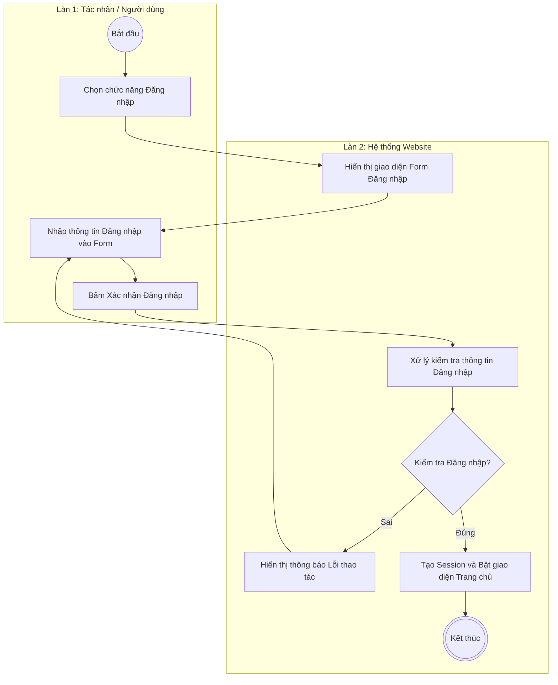

#### 2. UC2: Khám phá & Trải nghiệm nhạc (Nghe một bài nhạc mới)

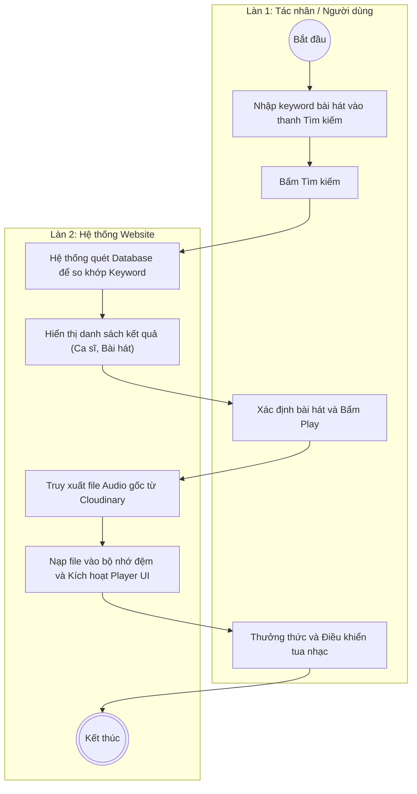

#### 3. UC3: Tương tác Cá nhân (Khởi tạo Playlist)

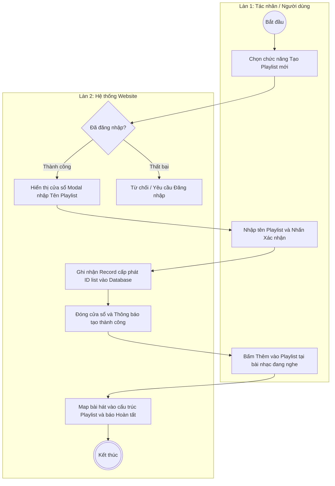

#### 4. UC4: Đóng góp Nội dung Audio (Quy trình Upload MP3)

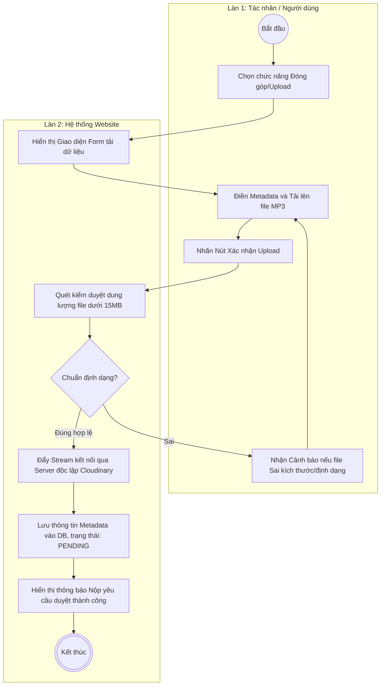

#### 5. UC5: Quản trị Hệ thống (Ví dụ: Khóa Ban User)

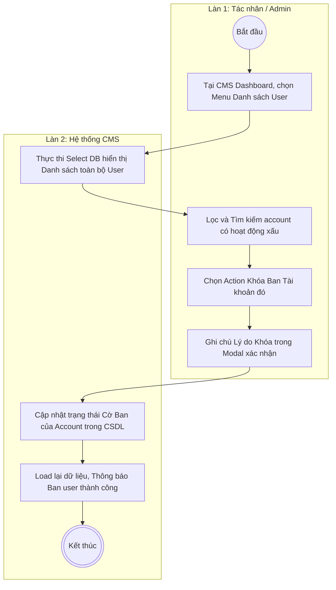

#### 6. UC6: Kiểm duyệt Sản phẩm (Duyệt Pending Uploads)

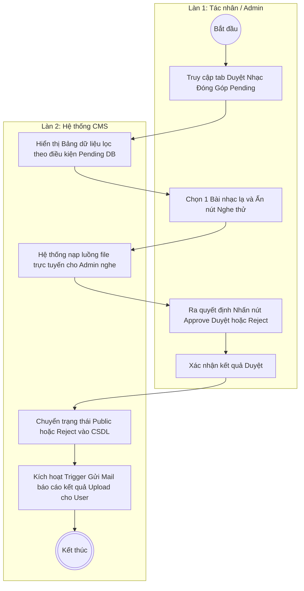

#### 7. UC7: Giao tiếp & Hỗ trợ (Live-chat Web socket)

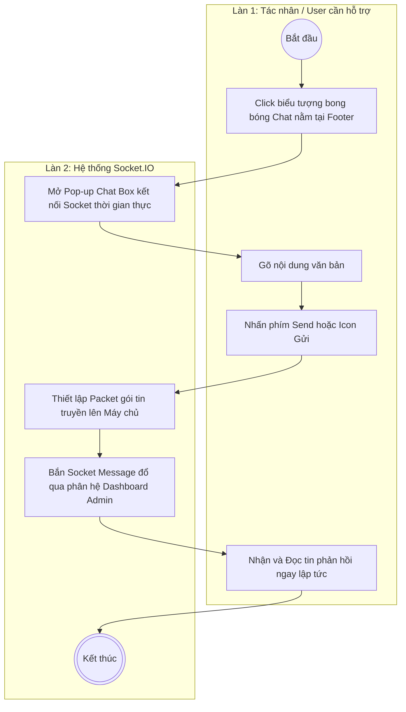

#### 8. UC8: Thuật toán Gợi ý Nhạc (Cold-Start Newbie)

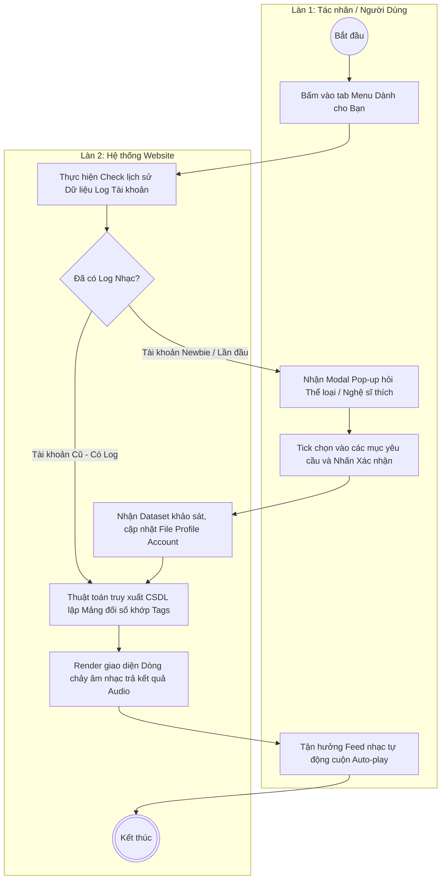
### 3.3 Biểu đồ Lớp (Class Diagram)

#### 3.3.1 Sơ đồ
Biểu đồ Lớp (Class Diagram) dưới đây được thiết kế để định hình cấu trúc dữ liệu tĩnh của toàn bộ hệ thống Website Nghe nhạc. Sơ đồ mô tả đầy đủ các Thuộc tính (Attributes), Phương thức (Methods) và Tầm vực truy cập (`+` Public, `-` Private, `#` Protected).

#### 3.3.2 Mô tả chi tiết Sơ đồ Lớp

Sơ đồ thể hiện rõ nét cấu trúc của 8 Lớp (Classes) cốt lõi cũng như các **mối quan hệ ràng buộc** phức tạp để đảm bảo tính toàn vẹn của Dữ liệu Hệ thống:

*   **Lớp Kế thừa (Inheritance - Mũi tên tam giác trắng):** 
    *   Lớp `NguoiDung` và `QuanTriVien` được thừa kế toàn bộ thuộc tính cơ sở (ID, Tên đăng nhập, Mật khẩu, Email) và phương thức (Đăng nhập, Quên MK) từ lớp cha trung tâm là `TaiKhoan`. Giúp tối ưu hóa và không phải viết lại Code xác thực (Authentication).
*   **Mối quan hệ Cấu thành (Composition - Hình thoi đen):** 
    *   Thể hiện sự gắn kết sống còn giữa `NguoiDung` và `DanhSachPhat` (Playlist). Dựa trên biểu đồ, nếu một tài khoản Người dùng bị Ban hoặc xóa khỏi Cơ sở Dữ liệu, hệ thống buộc phải Drop toàn bộ các Playlist cá nhân do họ tạo ra để tránh sinh ra dữ liệu rác (Orphan Data).
*   **Mối quan hệ Kết hợp (Aggregation - Hình thoi trắng):** 
    *   Thể hiện mối quan hệ lỏng lẻo giữa `DanhSachPhat` và `BaiHat`. Một Playlist chứa nhiều Bài hát, nhưng nếu Playlist bị người dùng bấm lệnh "Xóa", thì bản thân các tệp Bài hát (Media Files) vẫn tồn tại độc lập và nguyên vẹn trong Kho lưu trữ chung của hệ thống.
*   **Mối quan hệ Phụ thuộc (Dependency - Nét đứt):** 
    *   Đối tượng `QuanTriVien` (Admin) không sở hữu bài hát nhưng các hành động nghiệp vụ của Admin (`DuyetBaiHat()`, `TuChoiBaiHat()`) sẽ trực tiếp làm thay đổi thuộc tính `TrangThai_Duyet` của thực thể `BaiHat`.
*   **Lớp tương tác trung gian (Association Logic):** 
    *   Lớp `LichSuTuongTac` sinh ra nhằm lưu vết hành vi của User (nghe bài nào, thả tim khi nào, bỏ qua khi nào). Lớp này cung cấp Metadata Data khổng lồ cực kỳ quan trọng cho tính năng phân tích **Thuật toán Gợi ý Nhạc (For You Recommendation)**.

---

### Tú

#### 3.4 Biểu đồ Sequence (Biểu đồ Trình tự)

Biểu đồ trình tự mô tả cách thức các đối tượng trong hệ thống tương tác với nhau theo thời gian để thực hiện các nghiệp vụ then chốt.

**3.4.1 Luồng Xác thực và Truy cập (Auth Flow)**

*   **Mô tả:** Quy trình thiết lập phiên làm việc bảo mật, đảm bảo chỉ những người dùng hợp lệ mới có quyền truy cập vào các tài nguyên cá nhân hóa của MusicHub.
*   **Tác nhân:** Người dùng (Client), API Django (Backend), JWT Service.
*   **Điều kiện tiên quyết:** Người dùng đã có tài khoản và mật khẩu đã được mã hóa Bcrypt trong hệ thống.
*   **Luồng sự kiện chính:**
    1. Người dùng gửi thông tin đăng nhập từ giao diện React.
    2. Backend tiếp nhận yêu cầu và thực hiện truy vấn đối soát thông tin trong MySQL.
    3. Sau khi xác minh mã băm mật khẩu khớp, dịch vụ JWT sẽ khởi tạo bộ đôi Token (Access & Refresh).
    4. Client nhận Token thành công và lưu trữ vào LocalStorage để duy trì trạng thái đăng nhập.
*   **Luồng thay thế:** Nếu thông tin không chính xác, hệ thống trả về mã lỗi 401 Unauthorized kèm thông điệp cảnh báo.

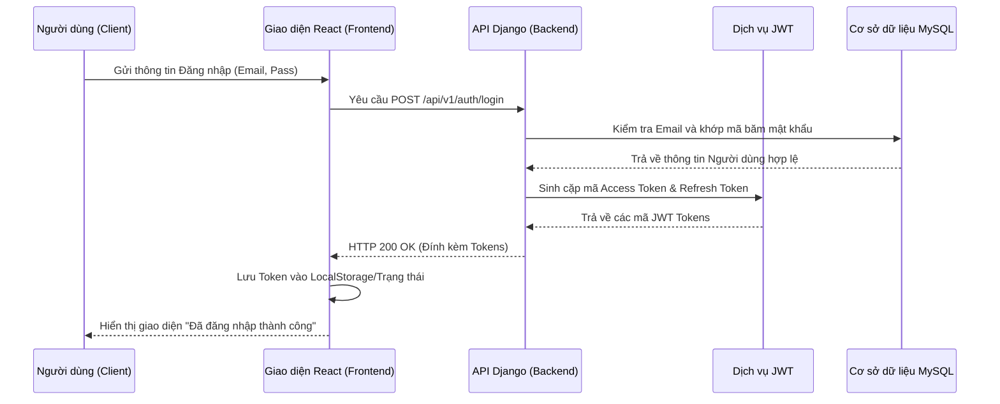

**3.4.2 Luồng Phát nhạc và Ghi nhận (Streaming Flow)**

*   **Mô tả:** Mô hình hóa cách thức hệ thống truyền tải dữ liệu âm thanh số từ kho lưu trữ đám mây tới người nghe.
*   **Tác nhân:** Người dùng, Trình phát nhạc, Cloudinary.
*   **Luồng sự kiện chính:**
    1. Người dùng chọn bài hát và nhấn "Phát".
    2. Frontend gửi yêu cầu lấy thông tin URL bảo mật tới Backend API.
    3. Backend kiểm tra tính khả dụng của tệp tin.
    4. Hệ thống trả về URL trỏ tới tệp .mp3 trên Cloudinary.
    5. Trình phát nạp dữ liệu và phát nhạc ra thiết bị.
    6. Sau 30 giây phát nhạc, hệ thống tự động gửi tín hiệu ghi nhận lượt nghe vào CSDL.

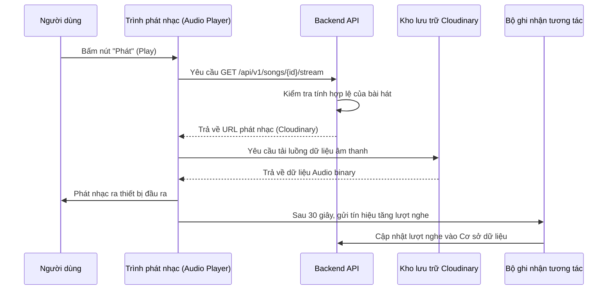

**3.4.3 Luồng Đóng góp và Kiểm duyệt (UGC Upload Flow)**

*   **Mô tả:** Quy trình cho phép người dùng (Creator) tải lên bài hát mới và quy trình kiểm duyệt nội dung của Admin.
*   **Tác nhân:** Người dùng (Creator), Admin, Cloudinary.
*   **Luồng sự kiện chính:**
    1. Người dùng gửi Metadata và tệp .mp3 từ giao diện tải lên.
    2. Backend đẩy tệp vật lý trực tiếp lên Cloudinary.
    3. Hệ thống lưu thông tin bài hát vào CSDL với trạng thái ban đầu là 'CHO_DUYET'.
    4. Admin truy cập bảng điều khiển, nghe thử và đánh giá nội dung.
    5. Admin thực hiện hành động 'Duyệt', hệ thống cập nhật trạng thái bài hát thành 'PUBLIC' và gửi thông báo tới người dùng.

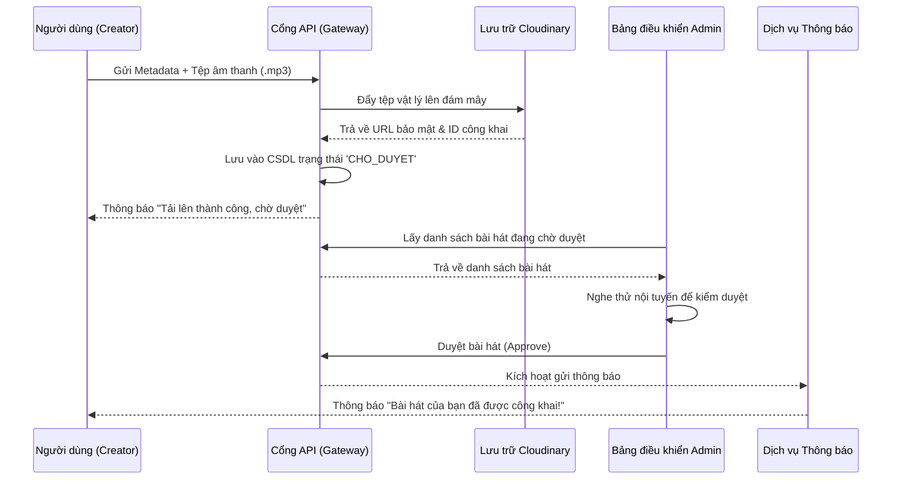

**3.4.4 Luồng Tìm kiếm và Lọc nhạc (Search & Filter Flow)**

*   **Mô tả:** Cơ chế truy vấn nhanh dựa trên từ khóa để người dùng tìm thấy nội dung mong muốn.
*   **Tác nhân:** Người dùng, Backend API, MySQL.
*   **Luồng sự kiện chính:**
    1. Người dùng nhập từ khóa tìm kiếm trên thanh Search.
    2. Frontend gửi yêu cầu truy vấn kèm từ khóa tới API.
    3. Backend thực hiện truy vấn tối ưu (Full-text search) trên các bảng Bài hát, Nghệ sĩ, Album.
    4. Hệ thống trả về danh sách kết quả dưới dạng JSON.
    5. Giao diện hiển thị kết quả phân loại rõ ràng cho người dùng.

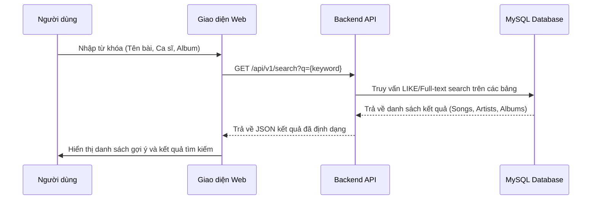

**3.4.5 Luồng Quản lý Playlist (Playlist Management Flow)**

*   **Mô tả:** Thao tác cá nhân hóa kho nhạc bằng cách tạo và quản lý các danh sách phát riêng.
*   **Tác nhân:** Người dùng, Backend API.
*   **Luồng sự kiện chính:**
    1. Người dùng nhấn 'Thêm vào Playlist' tại một bài hát cụ thể.
    2. Hệ thống tải danh sách Playlist hiện có của người dùng.
    3. Người dùng chọn Playlist mục tiêu.
    4. Backend ghi nhận mối quan hệ giữa ID bài hát và ID Playlist vào bảng chi tiết.
    5. Thông báo kết quả thành công tới người dùng.

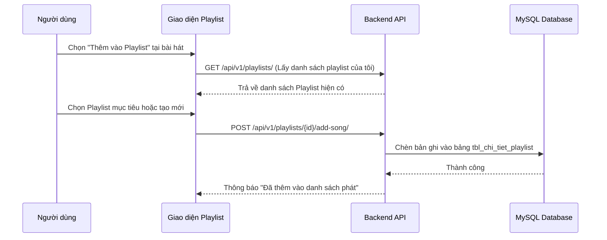

**3.4.6 Luồng Báo cáo và Xử lý Vi phạm (Reporting & Admin Flow)**

*   **Mô tả:** Cơ chế cho phép cộng đồng giám sát nội dung, đảm bảo môi trường âm nhạc lành mạnh và tuân thủ bản quyền.
*   **Tác nhân:** Người dùng, Backend API, Admin.
*   **Luồng sự kiện chính:**
    1. Người dùng gửi báo cáo kèm lý do vi phạm từ trang chi tiết bài hát.
    2. Backend ghi nhận báo cáo vào CSDL với trạng thái 'WAITING'.
    3. Admin nhận danh sách báo cáo tập trung tại Dashboard.
    4. Admin kiểm tra và thực hiện lệnh xử lý (Khóa bài hát/Gỡ nội dung).
    5. Hệ thống đồng bộ trạng thái mới và hoàn tất báo cáo.

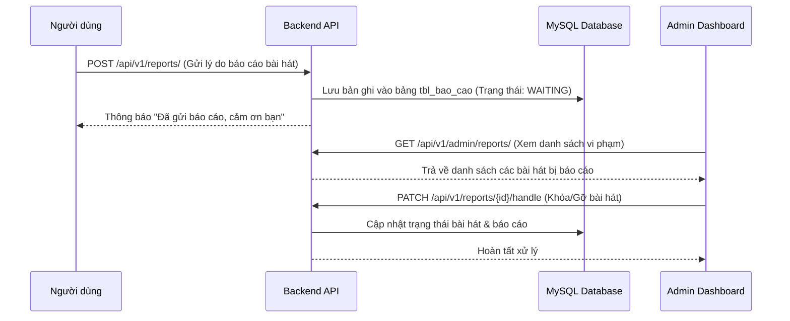

**3.4.7 Luồng Giao tiếp Live-chat (Support Chat Flow)**

*   **Mô tả:** Luồng dữ liệu thời gian thực (Real-time) cho phép người dùng nhận hỗ trợ trực tiếp từ đội ngũ Admin.
*   **Tác nhân:** Người dùng, Admin, Socket.io Server.
*   **Luồng sự kiện chính:**
    1. Người dùng gửi tin nhắn qua kết nối Socket.
    2. Server Socket xác thực quyền hạn thông qua JWT đính kèm.
    3. Server đẩy tin nhắn tức thời tới giao diện của Admin.
    4. Server ghi nội dung vào CSDL để lưu vết lịch sử.
    5. Admin phản hồi, tin nhắn được đẩy ngược lại thiết bị người dùng ngay lập tức.

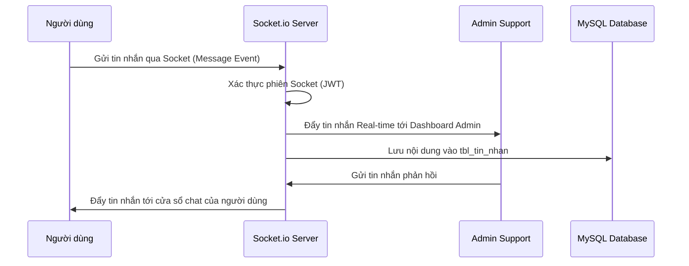

#### 3.5 Biểu đồ Thành phần (Component Diagram)

Biểu đồ Thành phần đóng vai trò là "bản đồ phân vùng" của hệ thống, mô tả cấu trúc vật lý của mã nguồn và cách các module được module hóa để đảm bảo tính độc lập. Trong một hệ thống streaming phức tạp như MusicHub, việc phân chia thành phần không chỉ giúp quản lý mã nguồn hiệu quả mà còn tối ưu hóa quá trình triển khai (Deployment) và bảo trì lâu dài. Mỗi thành phần được thiết kế như một hộp đen có giao tiếp xác định, cho phép các nhóm phát triển có thể làm việc song song mà không gây xung đột kiến trúc.

**3.5.1 Sơ đồ cấu trúc**

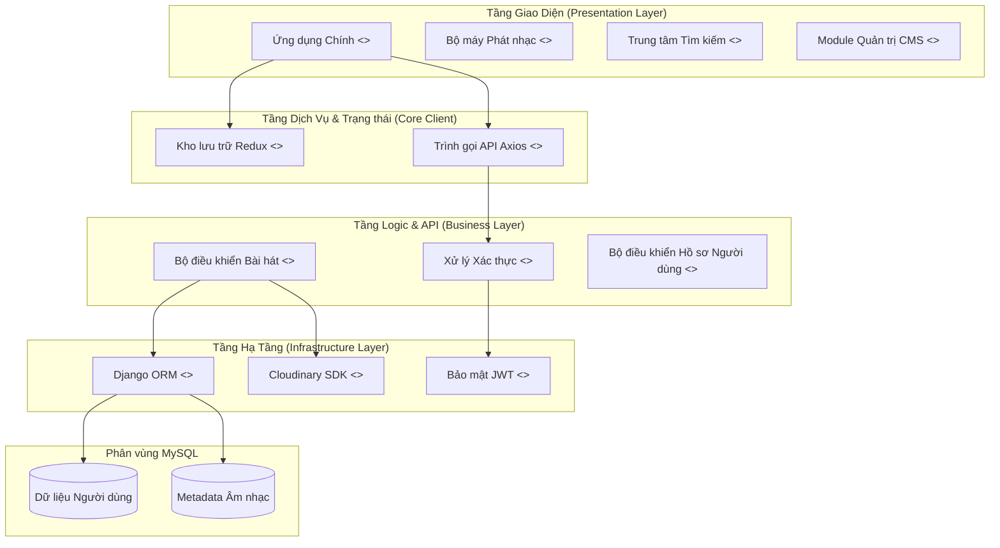

**3.5.2 Mô tả chi tiết các thành phần**

Hệ thống được thiết kế theo mô hình kiến trúc phân lớp (Layered Architecture), đảm bảo tính tách biệt (Decoupling) và dễ bảo trì:

*   **Tầng Giao Diện (Presentation Layer):**
    *   **Ứng dụng Chính:** Thành phần gốc điều phối Routing và Layout tổng thể của website ReactJS.
    *   **Bộ máy Phát nhạc (Music Player Engine):** Module lõi xử lý các trạng thái phát nhạc toàn cục, đảm bảo âm nhạc không bị ngắt quãng.
    *   **Trung tâm Tìm kiếm:** Xử lý logic hiển thị kết quả tìm kiếm nhanh và các bộ lọc thông minh.
    *   **Module Quản trị CMS:** Giao diện quản lý nội dung chuyên sâu dành cho đội ngũ Admin.

*   **Tầng Dịch Vụ & Trạng thái (Core Client):**
    *   **Kho lưu trữ Redux:** Quản lý trạng thái tập trung cho toàn bộ ứng dụng (Auth, Player, Playlist).
    *   **Trình gọi API Axios:** Cấu hình các interceptor để quản lý Token JWT và xử lý lỗi hệ thống đồng nhất.

*   **Tầng Logic & API (Business Layer):**
    *   **Bộ điều khiển Bài hát (Music Controllers):** Chứa các logic nghiệp vụ về xử lý metadata, quản lý quyền tệp nhạc và tính toán lượt nghe.
    *   **Xử lý Xác thực (Auth Handlers):** Module chuyên trách kiểm soát luồng định danh và phân quyền (RBAC) cho hệ thống.
    *   **Bộ điều khiển Hồ sơ (Profile Controllers):** Xử lý các yêu cầu cập nhật thông tin cá nhân và quản lý dữ liệu lịch sử nghe nhạc.

*   **Tầng Hạ Tầng (Infrastructure Layer):**
    *   **Django ORM:** Lớp trừu tượng hóa giúp truy vấn cơ sở dữ liệu MySQL một cách an toàn và hiệu quả.
    *   **Bảo mật JWT:** Hệ thống kiểm soát quyền truy cập dựa trên Token không trạng thái (Stateless).
    *   **Cloudinary SDK:** Module kết nối trực tiếp với dịch vụ đám mây để truyền tải và lưu trữ tệp âm thanh/hình ảnh tối ưu.

---

## IV. THIẾT KẾ DỮ LIỆU (Tú)

### 4.1 Mô tả dữ liệu
Trong kiến trúc của hệ thống MusicHub, dữ liệu không chỉ đơn thuần là những bản ghi lưu trữ, mà là "linh hồn" định hình nên toàn bộ trải nghiệm người dùng. Quá trình thiết kế dữ liệu tại đây được thực hiện dựa trên việc phân tích sâu sắc các thực thể nghiệp vụ, từ đó chuyển hóa chúng thành một mô hình quan hệ bền vững, linh hoạt và có khả năng mở rộng cao. Mỗi thực thể (entity) được xác định đều mang trong mình một vai trò chiến lược, đảm bảo sự luân chuyển thông tin luôn chính xác và an toàn.

Hệ thống sử dụng cơ sở dữ liệu quan hệ MySQL, được thiết kế tối ưu theo chuẩn 3NF (Third Normal Form) nhằm loại bỏ sự dư thừa và duy trì tính nhất quán tuyệt đối của dữ liệu. Các nhóm thực thể trọng tâm bao gồm:

*   **Hệ sinh thái Tài khoản & Định danh**: Quản lý toàn bộ thông tin định danh, hồ sơ cá nhân và phân quyền hành động của người dùng, đảm bảo tính bảo mật và cá nhân hóa tối đa.
*   **Thư viện Metadata Âm nhạc**: Lưu trữ cấu trúc phân cấp phức tạp giữa Bài hát, Nghệ sĩ, Album và Thể loại, tạo nên một mạng lưới nội dung phong phú và dễ dàng truy xuất.
*   **Hệ thống Tương tác & Hành vi**: Ghi nhận các điểm chạm cảm xúc của người dùng như lượt yêu thích, danh sách phát tự tạo và lịch sử nghe nhạc thời gian thực.
*   **Kiểm soát & Quản trị**: Lưu vết các báo cáo vi phạm, nội dung đóng góp từ cộng đồng và các kênh giao tiếp hỗ trợ, giúp duy trì sự lành mạnh của nền tảng.

### 4.2 Biểu đồ ER (Entity-Relationship Diagram) [Cập nhật]

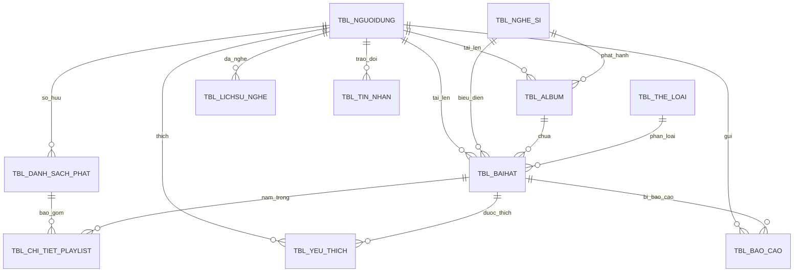

### 4.3 Thiết kế dữ liệu chi tiết

**1. Bảng: tbl_nguoi_dung (Quản lý tài khoản và người dùng)**
| Trường | Kiểu dữ liệu | Ràng buộc | Mô tả |
| :--- | :--- | :--- | :--- |
| id_nguoi_dung | INT | PK, AI | Mã định danh duy nhất |
| ten_dang_nhap | VARCHAR(50) | UNIQUE, NN | Tên đăng nhập |
| email | VARCHAR(100)| UNIQUE, NN | Email người dùng |
| mat_khau | VARCHAR(255)| NN | Mật khẩu (đã băm Bcrypt) |
| ho_ten | VARCHAR(100)| NULL | Họ và tên đầy đủ |
| anh_dai_dien | TEXT | Default: 'def.jpg' | Link ảnh đại diện |
| vai_tro | ENUM | 'USER', 'ADMIN' | Phân cấp quyền hạn |
| ngay_tham_gia | TIMESTAMP | DEFAULT CURRENT_TIMESTAMP| Ngày tham gia |

**2. Bảng: tbl_bai_hat (Quản lý thông tin bài hát)**
| Trường | Kiểu dữ liệu | Ràng buộc | Mô tả |
| :--- | :--- | :--- | :--- |
| id_bai_hat | INT | PK, AI | Mã bài hát |
| tieu_de | VARCHAR(255)| NN | Tiêu đề bài hát |
| duong_dan_am_thanh | TEXT | NN | Link stream |
| duong_dan_hinh_anh | TEXT | NN | Ảnh bìa |
| luot_nghe | INT | Default: 0 | Tổng lượt nghe |
| quoc_gia | VARCHAR(50) | NULL | Quốc gia phát hành |
| nam_phat_hanh | INT | NULL | Năm phát hành |
| trang_thai | ENUM | 'PENDING', 'PUBLIC'| Trạng thái kiểm duyệt |
| id_nghe_si | INT | FK to tbl_nghe_si | Nghệ sĩ trình bày |
| id_album | INT | FK to tbl_album | Thuộc Album (nếu có) |
| id_the_loai | INT | FK to tbl_the_loai | Thể loại |
| id_nguoi_dang | INT | FK to tbl_nguoi_dung | Người upload |

**3. Bảng: tbl_album (Quản lý Album nhạc)**
| Trường | Kiểu dữ liệu | Ràng buộc | Mô tả |
| :--- | :--- | :--- | :--- |
| id_album | INT | PK, AI | Mã album |
| tieu_de | VARCHAR(255)| NN | Tên album |
| anh_bia | TEXT | NN | Hình ảnh đại diện album |
| id_nghe_si | INT | FK to tbl_nghe_si | Nghệ sĩ sở hữu |
| trang_thai | ENUM | 'PENDING', 'PUBLIC'| Trạng thái duyệt |
| ngay_phat_hanh | DATE | NULL | Ngày phát hành album |

**4. Bảng: tbl_nghe_si (Thông tin nghệ sĩ)**
| Trường | Kiểu dữ liệu | Ràng buộc | Mô tả |
| :--- | :--- | :--- | :--- |
| id_nghe_si | INT | PK, AI | Mã nghệ sĩ |
| ten_nghe_si | VARCHAR(150)| NN | Tên ca sĩ/nhóm nhạc |
| tieu_su | TEXT | NULL | Thông tin tiểu sử |
| anh_nghe_si | TEXT | NULL | Ảnh đại diện nghệ sĩ |

**5. Bảng: tbl_danh_sach_phat (Quản lý Playlist)**
| Trường | Kiểu dữ liệu | Ràng buộc | Mô tả |
| :--- | :--- | :--- | :--- |
| id_danh_sach_phat | INT | PK, AI | Mã playlist |
| tieu_de | VARCHAR(255)| NN | Tên Playlist |
| id_chu_so_huu | INT | FK to tbl_nguoi_dung | Người tạo |
| ngay_tao | TIMESTAMP | DEFAULT CURRENT_TIMESTAMP| Thời gian tạo |

**6. Bảng: tbl_the_loai (Danh mục thể loại nhạc)**
| Trường | Kiểu dữ liệu | Ràng buộc | Mô tả |
| :--- | :--- | :--- | :--- |
| id_the_loai | INT | PK, AI | Mã thể loại |
| ten_the_loai | VARCHAR(100)| NN | Tên thể loại |
| mo_ta_the_loai| TEXT | NULL | Mô tả |

**7. Bảng: tbl_bao_cao (Quản lý báo cáo vi phạm)**
| Trường | Kiểu dữ liệu | Ràng buộc | Mô tả |
| :--- | :--- | :--- | :--- |
| id_bao_cao | INT | PK, AI | Mã báo cáo |
| id_nguoi_dung | INT | FK to tbl_nguoi_dung | Người báo cáo |
| id_bai_hat | INT | FK to tbl_bai_hat | Bài hát bị báo cáo |
| ly_do | TEXT | NN | Lý do vi phạm |
| trang_thai_xu_ly| ENUM | 'WAITING', 'DONE' | Tình trạng xử lý |
| ngay_bao_cao | TIMESTAMP | DEFAULT CURRENT_TIMESTAMP| Thời điểm báo cáo |

**8. Bảng: tbl_lich_su_nghe (Lịch sử nghe nhạc)**
| Trường | Kiểu dữ liệu | Ràng buộc | Mô tả |
| :--- | :--- | :--- | :--- |
| id_lich_su | INT | PK, AI | Mã bản ghi |
| id_nguoi_dung | INT | FK to tbl_nguoi_dung | Người nghe |
| id_bai_hat | INT | FK to tbl_bai_hat | Bài hát đã nghe |
| thoi_gian_nghe | TIMESTAMP | DEFAULT CURRENT_TIMESTAMP| Lúc nghe |

**9. Bảng: tbl_tin_nhan (Chat hỗ trợ)**
| Trường | Kiểu dữ liệu | Ràng buộc | Mô tả |
| :--- | :--- | :--- | :--- |
| id_tin_nhan | INT | PK, AI | Mã tin nhắn |
| id_nguoi_gui | INT | FK to tbl_nguoi_dung | Người gửi (User/Admin) |
| id_nguoi_nhan | INT | FK to tbl_nguoi_dung | Người nhận |
| noi_dung | TEXT | NN | Nội dung chat |
| thoi_gian_gui | TIMESTAMP | DEFAULT CURRENT_TIMESTAMP| Thời điểm gửi |

**10. Bảng: tbl_chi_tiet_playlist (Bảng trung gian)**
| Trường | Kiểu dữ liệu | Ràng buộc | Mô tả |
| :--- | :--- | :--- | :--- |
| id_chi_tiet | INT | PK, AI | Mã bản ghi |
| id_danh_sach_phat | INT | FK to tbl_danh_sach_phat | Tham chiếu Playlist |
| id_bai_hat | INT | FK to tbl_bai_hat | Tham chiếu Bài hát |

**11. Bảng: tbl_yeu_thich (Lưu trữ bài hát yêu thích)**
| Trường | Kiểu dữ liệu | Ràng buộc | Mô tả |
| :--- | :--- | :--- | :--- |
| id_yeu_thich | INT | PK, AI | Mã bản ghi |
| id_nguoi_dung | INT | FK to tbl_nguoi_dung | Người thích |
| id_bai_hat | INT | FK to tbl_bai_hat | Bài hát được thích |
| ngay_thich | TIMESTAMP | DEFAULT CURRENT_TIMESTAMP| Lúc nhấn thích |

---
© 2026 MusicHub Project - Documentation by Vinh & Tú.
