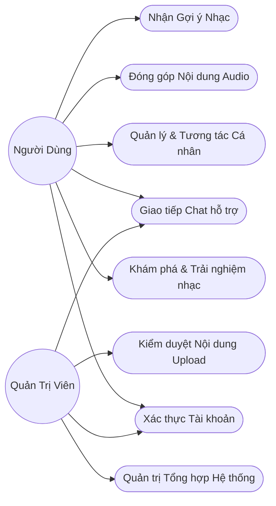
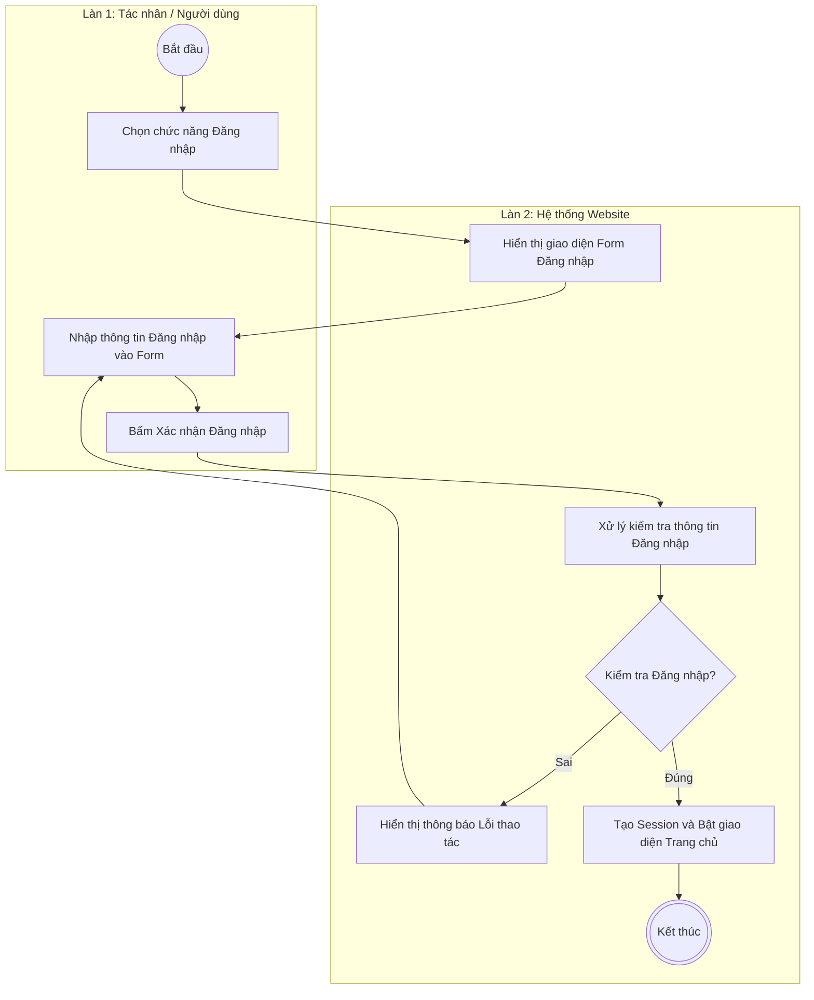
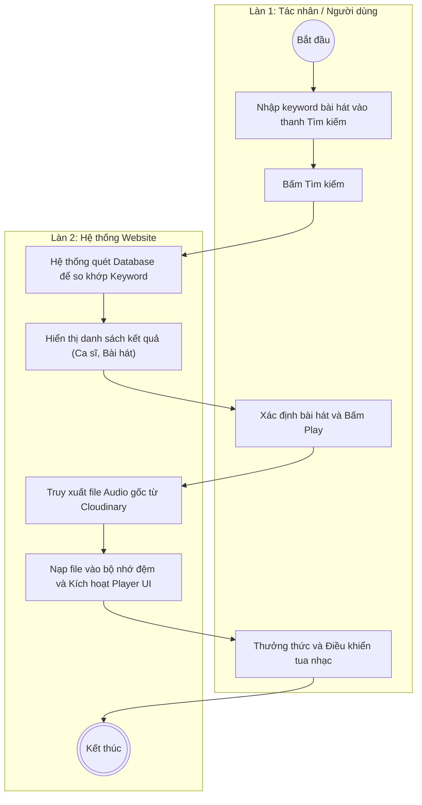
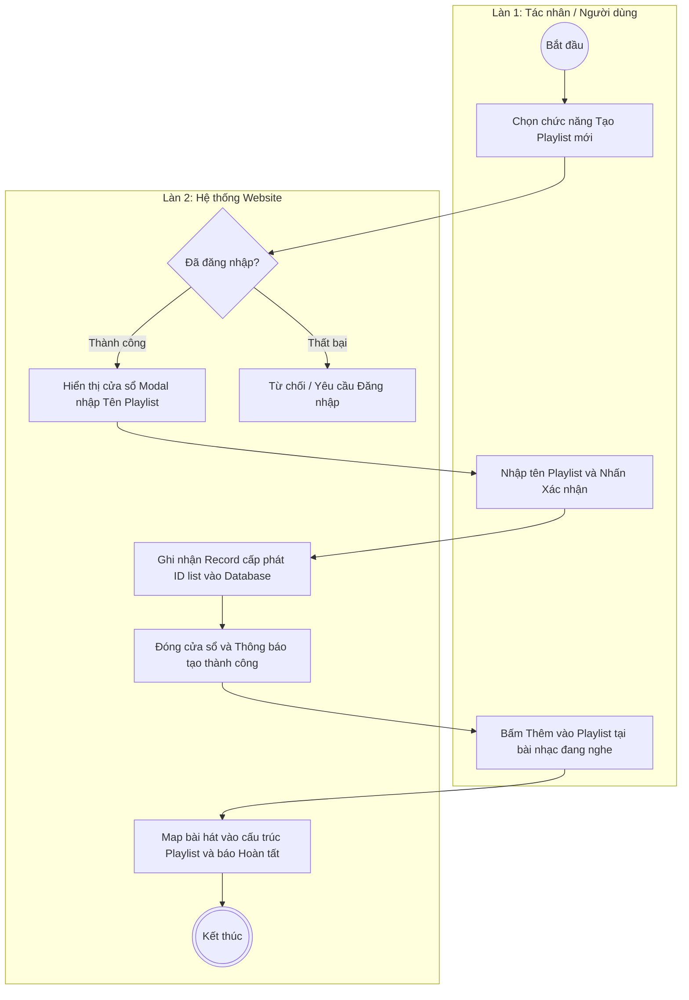
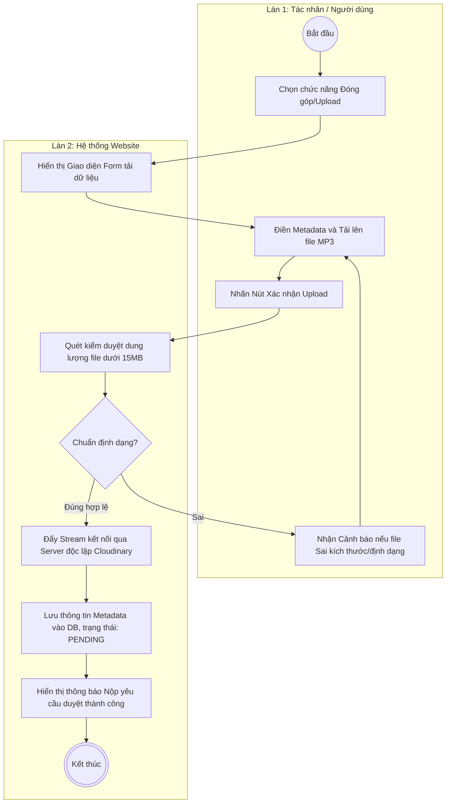
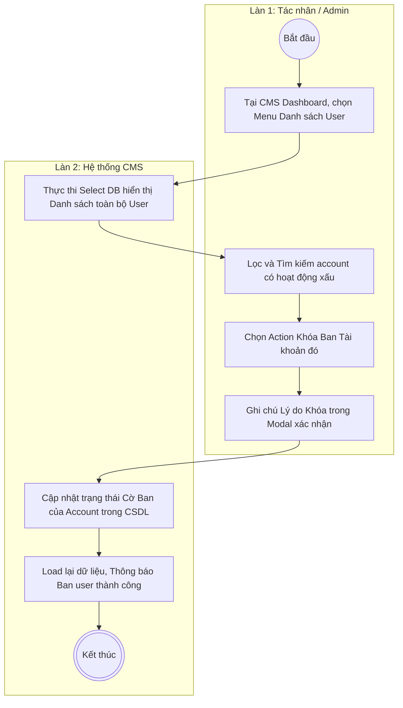
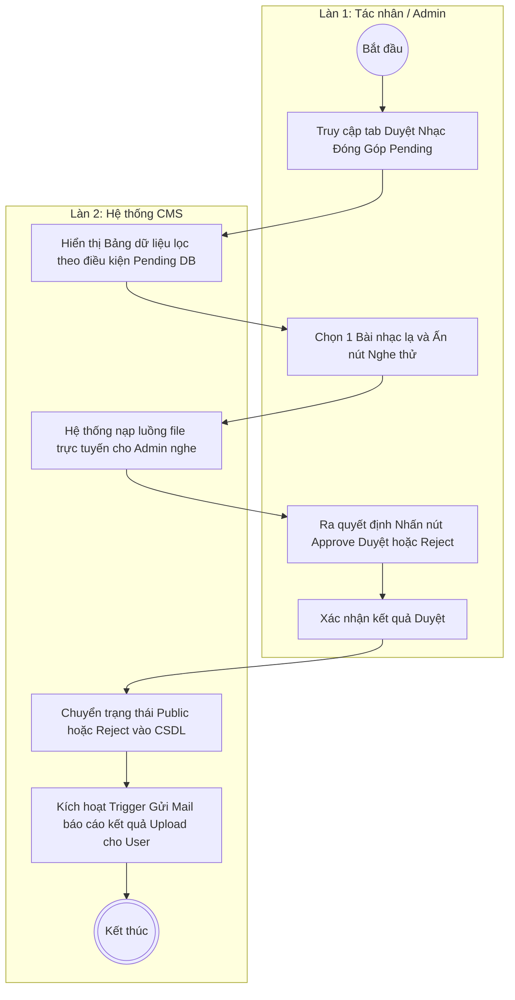
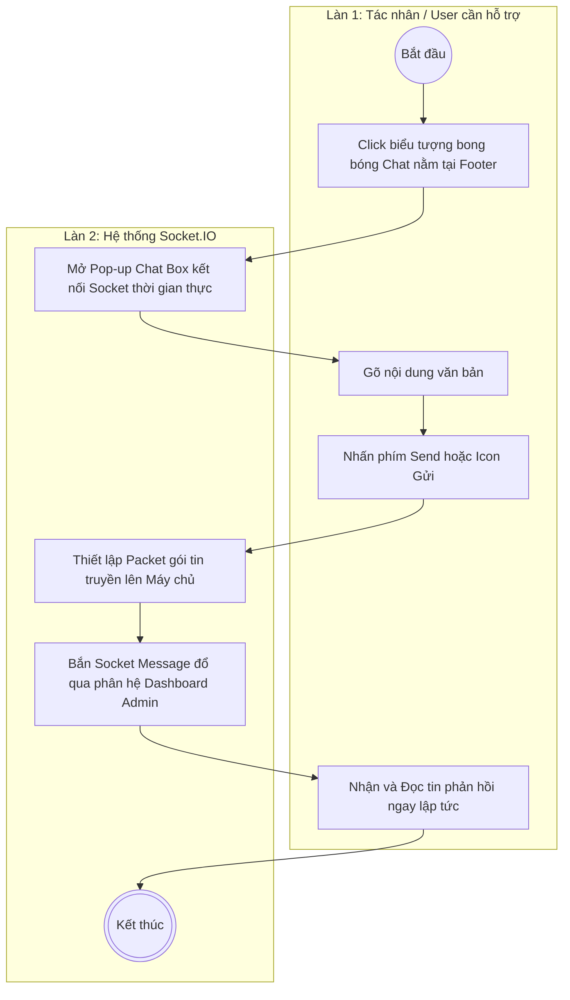
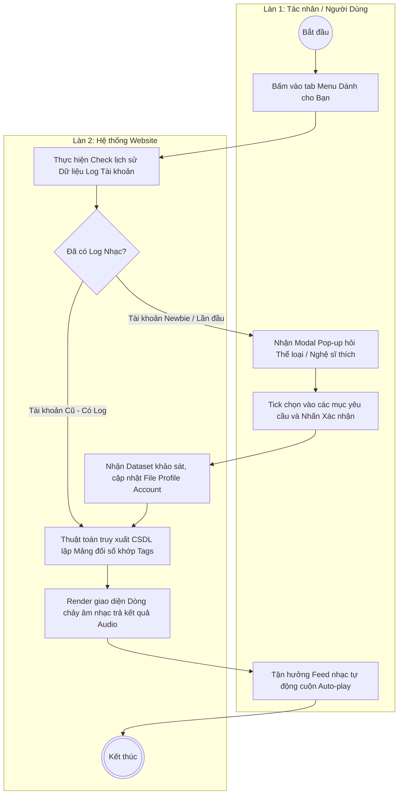
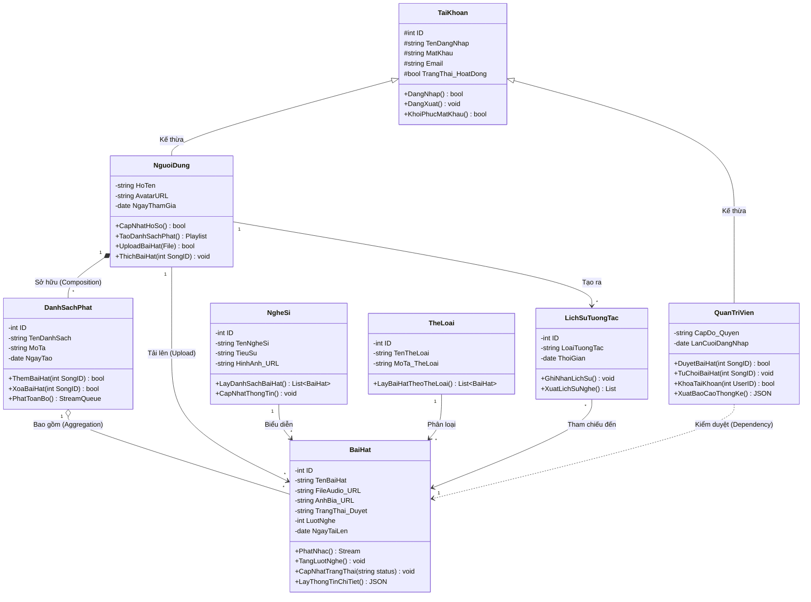

### File SDD

Mục lục

I. Giới thiệu Tú

    1.1 Mục đích tài liệu
    1.2 Phạm vi tài liệu
    1.3 Thuật ngữ và các từ viết tắt
    1.4 Tài liệu tham khảo
    1.5 Mô tả tài liệu

II. Khảo sát hiện trạng phần mềm Vinh

    2.1 Khảo sát hiện trạng
    	2.2 Mục tiêu tổng quát

2.3 Mục tiêu cụ thể
2.4 Phạm vi dự án
Khu vực triển khai
Đối tượng người dùng
Chức năng chính
Hạn chế
ĐỊnh hướng mở rộng

III. Thiết kế hệ thống phần mềm

Vinh

    3.1 Biểu đồ usecase
    	3.2 Biểu đồ activity
    	3.3 Biểu đồ class

Tú

    3.4 Biểu đồ sequence

3.5 Biểu đồ component

IV. Thiết kế dữ liệu Tú

    4.1 Mô tả dữ liệu
    	4.2 Biểu đồ ER
    	4.3 Thiết kế dữ liệu

V. Thiết kế giao diện

    (Giao diện các trang)

---

## II. Khảo sát hiện trạng phần mềm

### 2.1 Khảo sát hiện trạng

Trong bối cảnh bùng nổ của thời đại số hóa, nhu cầu giải trí và thưởng thức âm nhạc trực tuyến mọi lúc, mọi nơi của con người ngày càng trở nên thiết yếu. Để dự án Website Nghe Nhạc Trực Tuyến có thể bám sát được thực tiễn và đáp ứng tốt nhất nhu cầu của người dùng, nhóm phát triển đã tiến hành khảo sát, phân tích hiện trạng các nền tảng âm nhạc đang tồn tại trên thị trường:

**1. Hiện trạng thị trường và các ứng dụng có sẵn:**

- Hiện nay, thị trường streaming nhạc có sự tham gia của nhiều nền tảng mạnh mẽ cả trong lẫn ngoài nước như _Zing MP3, NhacCuaTui, Spotify, Apple Music_ và _YouTube Music_.
- Các nền tảng này mang lại trải nghiệm tuyệt vời với kho nhạc đồ sộ cùng hệ thống thuật toán gợi ý hành vi cá nhân hóa cao.
- Tuy nhiên, phần lớn các ứng dụng đang dần thương mại hóa mạnh, yêu cầu người dùng nâng cấp lên tài khoản trả phí (VIP/Premium) để sử dụng các tiện ích cơ bản như: nghe nhạc chất lượng cao (320kbps/lossless), tải nhạc ngoại tuyến, hay phổ biến nhất là nghe nhạc không gián đoạn bởi quảng cáo. Điều này gây khó khăn tiếp cận đối với nhóm đối tượng học sinh, sinh viên hoặc những người có thu nhập thấp.

**2. Khó khăn trong việc giao lưu và chia sẻ âm nhạc từ cộng đồng (User-Generated Content):**

- Các nền tảng lớn tập trung phân phối bản quyền chính thống từ các nghệ sĩ lớn và công ty giải trí. Do đó, quy trình đưa một tác phẩm lên nền tảng thường rất khắt khe và phức tạp qua các nhà phân phối (Distributors).
- Những bản nhạc Cover, các luồng remix tự do (Nonstop/Vinahouse), hoặc hoạt động của các nghệ sĩ phòng thu độc lập (Indie/Underground) rất khó khăn để tiếp cận thính giả trực tiếp bằng chính tài khoản của họ.
- Người dùng thiếu đi một "bộ lưu trữ đám mây" chuyên biệt về âm nhạc để tự do đăng tải định dạng `.mp3` lên server và nghe chéo ở nhiều thiết bị.

**3. Hiện trạng về mặt công nghệ (Technological Context):**

- Chuyển dịch kiến trúc linh hoạt: Ở các mô hình hệ thống cũ, việc điều hướng (chuyển trang) sẽ khiến trang web tải lại (reload), làm đứt gãy luồng phát của dòng âm thanh đang duy trì. Giải quyết triệt để khuyết điểm này bằng kiến trúc Single Page Application (SPA) của các framework hiện đại như ReactJS/VueJS là một yêu cầu bắt buộc của mọi nền tảng Streaming web hiện nay.
- Quản lý băng thông (Bandwidth Management): Việc lưu trữ hàng chục ngàn file Media âm thanh có thể bòn rút và làm tê liệt server truyền thống một cách nhanh chóng. Thị trường hiện nay ưa chuộng sử dụng các kho lưu trữ đám mây bên thứ ba (như Cloudinary, AWS S3) để phân tải tệp kỹ thuật số, giảm áp lực mạng cho máy chủ nghiệp vụ nội bộ.

**=> Kết luận:**
Từ những nhận định trên, việc xây dựng một **Website nghe nhạc trực tuyến** đi theo hướng tiếp cận mở: vừa cung cấp các tiện ích cốt lõi của một Music Player mượt mà (SPA web), vừa xây dựng môi trường cho phép **cộng đồng tự do đóng góp Upload file âm thanh** (dưới sự kiểm duyệt của Admin), đi kèm mã nguồn vận hành độc lập là hoàn toàn có tính thực tiễn cao, giúp thu hút nhóm ngách người dùng có nhu cầu cá nhân hóa bộ sưu tập âm nhạc của riêng họ.

### 2.2 Mục tiêu tổng quát (General Objectives)

Dựa trên kết quả từ quá trình khảo sát hiện trạng và định vị được những "nỗi đau" (pain points) của người dùng hiện tại, nhóm phát triển đặt ra các mục tiêu tổng quát (General Objectives) cho dự án phần mềm **Website Nghe Nhạc Trực Tuyến** như sau:

**1. Xây dựng môi trường Âm nhạc mở, Miễn phí (Free-to-Use Platform):**
Phát triển một nền tảng âm nhạc có khả năng cung cấp đầy đủ các nhu cầu giải trí và tiện ích cốt lõi nhất (như nghe nhạc chất lượng cao, phát nhạc nền liên tục, tự do tạo lập Playlist) hoàn toàn miễn phí, hướng đến tệp khách hàng tiềm năng là học sinh, sinh viên.

**2. Phát triển Cộng đồng chia sẻ nội dung độc lập (User-Generated Content):**
Tạo ra một không gian tương tác mà ở đó, người dùng không chỉ đóng vai trò là "thính giả" (Listener) mà còn là "người sáng tạo" (Creator). Website sẽ cung cấp công cụ cho phép cá nhân tự do tải lên (Upload) các file audio (.mp3), chia sẻ những bản nhạc Indie, Cover, Remix độc quyền của họ đến cộng đồng một cách trực tiếp và nhanh chóng nhất.

**3. Tối ưu hóa Trải nghiệm Người dùng (UX/UI Optimization):**

- **Về mặt giao diện:** Thiết kế giao diện hiện đại, trực quan (lấy cảm hứng từ NhacCuaTui) với thao tác mượt mà, thân thiện.
- **Về mặt trải nghiệm âm thanh:** Áp dụng mô hình Single Page Application (SPA) trên Frontend để đảm bảo luồng phát nhạc (Audio Player) diễn ra liên tục, liền mạch, không bao giờ bị đứt quãng khi người dùng thao tác chuyển đổi qua lại giữa các trang.

**4. Thiết lập Hệ thống Quản trị (CMS) mạnh mẽ, an toàn:**
Vì dự án đi theo hướng mở cho phép người dùng tự tải nhạc, mục tiêu then chốt là phải trang bị cho Quản trị viên (Admin) một hệ thống bảng điều khiển (Dashboard) toàn diện. Hệ thống này phải có khả năng kiểm duyệt nội dung chờ duyệt (Pending Uploads) dễ dàng bằng công cụ nghe thử nội tuyến, nhằm loại trừ kịp thời các nội dung vi phạm bản quyền hay quy chuẩn đạo đức trước khi hòa vào kho nhạc chung.

**5. Đảm bảo Kiến trúc linh hoạt và Khả năng mở rộng (Scalability):**
Thiết kế kiến trúc hệ thống 3 lớp (3-Tier) phân tách rõ ràng giữa Logic xử lý (Backend) và Lưu trữ tĩnh (Cloud Storage chuyên biệt cho Audio/Image). Mục tiêu là hệ thống phải chịu tải tốt, tiết kiệm băng thông và dễ dàng nâng cấp (scale-up) thêm các máy chủ trong tương lai khi cộng đồng phát triển mà không phải đập bỏ mã nguồn cũ.

### 2.3 Mục tiêu cụ thể (Specific Objectives)

Để hiện thực hóa các mục tiêu tổng quát bên trên, hệ thống cần đạt được các chỉ tiêu chi tiết đo lường được trên 3 phương diện chính:

**1. Mục tiêu về Chức năng nghiệp vụ (Functional Objectives):**

- **Module Nghe Nhạc:** Hoàn thiện trình phát nội tuyến (Audio Player) với đầy đủ các tính năng điều khiển cơ bản (Phát/Dừng, Chuyển tiếp/Lùi bài, Lặp lại (Loop) thông minh, Trộn bài (Shuffle)) và chức năng hiển thị lời nhạc đồng bộ.
- **Module Tìm kiếm & Khám phá:** Cung cấp Live-search và Bảng xếp hạng. Đặc biệt, xây dựng trang **Dành cho bạn (For You)** để nhóm ngẫu nhiên hoặc đề xuất các bài hát cùng chung Thể loại/Ca sĩ dựa trên lịch sử của User.
- **Module Cá nhân hóa:** Thiết kế không gian "Tủ nhạc Góc Tui" cho phép người dùng tự do thêm mới, sửa tên Playlist riêng biệt và lưu trữ nhanh danh sách các "Bài hát yêu thích".
- **Module Đóng góp & Kiểm duyệt (UGC):** Hoàn thiện luồng quy trình: Người dùng phổ thông tạo Form đính kèm và uplaod Audio file (.mp3) -> Admin nhận tín hiệu Pending -> Quản trị viên sử dụng bảng điều khiển CMS để nghe thử nội tuyến rồi quyết định Bấm "Duyệt" (Public) hoặc "Từ chối" (Reject).

**2. Mục tiêu về Chỉ tiêu Kỹ thuật (Technical & Security Objectives):**

- **Kiến trúc SPA:** Thiết lập Frontend chuẩn **ReactJS** để kiểm soát Global State, giúp quá trình chuyển hướng trang URL (Routing) hoàn toàn vô hình, ngăn chặn tuyệt đối tình trạng đứt đoạn nhạc do reload Page.
- **Xử lý Băng thông Media:** Hủy bỏ việc lưu trữ file trên ổ cứng Server gốc. Toàn bộ tệp âm thanh/hình ảnh bản quyền lớn phải được ánh xạ lưu trữ qua mây **Cloudinary**. Máy chủ chỉ nhận việc làm trung gian bảo mật luồng URL nhạc gửi xuống Client.
- **Bảo mật:** Quản lý phiên tài khoản người dùng bảo mật không trạng thái qua **JWT (JSON Web Token)**. Cam kết mã hóa (Hashing) một chiều toàn bộ mật khẩu trước khi chèn vào MySQL.
- **Tối ưu CSDL:** Chuẩn hóa thiết kế lược đồ quan hệ thực thể (ERD), có đầy đủ ràng buộc khóa ngoại (Foreign key) qua **Django ORM** để đạt hiệu suất khi truy xuất liên kết Playlist - Chi tiết Bài hát - Người dùng.

**3. Mục tiêu về Đóng gói và Triển khai (Deployment Objectives):**

- Đóng gói thành công môi trường của Frontend (NodeJS) và Backend (Python) vào hệ sinh thái container **Docker** thông qua cấu hình `docker-compose.yml`.
- Thiết lập mô hình **CI/CD** tự động cơ bản qua kho chứa Git tập trung: mỗi khi có phiên bản mã nguồn mới được hợp nhất (Merge) vào dự án, hệ thống phải tự hỗ trợ Build luồng để thay mới tính năng nhanh nhất.

### 2.4 Phạm vi dự án (Project Scope)

Dự án Website Nghe Nhạc Trực Tuyến tập trung giải quyết các bài toán về luồng cung cấp và trải nghiệm âm thanh chủ yếu trên nền tảng Web. Dựa theo nguồn lực hiện tại, phạm vi thiết kế và phát triển của dự án được khoanh vùng cực kỳ rõ nét như sau:

**1. Môi trường triển khai:**

- Hệ thống được thiết kế dưới dạng Website Ứng dụng (Web Application) tập trung phục vụ khách truy cập thông qua các trình duyệt Web hiện đại phổ biến (Chrome, Edge, Safari, FireFox).
- Giao diện thiết kế theo phương châm linh hoạt (Responsive UI) hỗ trợ sử dụng tốt trên cả kích cỡ màn hình Desktop và điện thoại (Mobile Web), thu hẹp khoảng cách trải nghiệm trên mọi thiết bị.

**2. Đối tượng phục vụ:**

- **Thính giả & Cộng đồng (User):** Cung cấp môi trường tiêu thụ âm nhạc miễn phí, không rào cản thao tác. Mở rộng cho một phần đối tượng là các Creator nghiệp dư có nhu cầu đăng tải (Upload) file `.mp3` độc quyền của cá nhân họ.
- **Ban Quản trị (Admin):** Cán bộ vận hành hệ thống, sử dụng quyền lực tối cao để làm sạch nội dung, đình chỉ thành viên vi phạm quy chuẩn ứng xử.

**3. Khối lượng chức năng dự kiến đưa vào phát triển (In-scope):**

- Hệ thống Gợi ý nhạc cơ bản (Recommendation) hiển thị ở trang Dành cho bạn.
- Triển khai bộ máy Audio Player hoàn chỉnh (Phát, Tạm dừng, Trộn bài, Lặp lại).
- Triển khai Cơ sở dữ liệu và API xử lý Thư viện nhạc cá nhân (Yêu thích nhạc, Tạo Danh sách phát - Playlist).
- Kiến trúc đẩy tệp lớn (Media Storage) tích hợp qua hạ tầng đám mây phân tán lưu trữ (Cloudinary).
- Hệ thống phân quyền truy cập thông qua mã bảo mật JSON Web Token (JWT).
- Biểu mẫu chức năng cho phép Upload và nền tảng Kiểm duyệt nội dung (Approve / Reject) dùng riêng cho Admin.

**4. Giới hạn hoặc Các yếu tố nằm ngoài phạm vi (Out of Scope):**

- **Ứng dụng trên Điện thoại (Mobile Native App):** Dự án không bao gồm việc code và phát hành phiên bản App độc lập phân phối thông qua CH Play (Android) hay App Store (iOS) ở Phase 1.
- **Cổng Thanh Toán (Payment Gateways):** Hệ thống bỏ qua hoàn toàn việc giao dịch thương mại, không có chức năng yêu cầu thẻ tín dụng, nạp gói Premium hay bán nhạc. 100% Music Catalog được cung cấp hoàn toàn phi lợi nhuận.
- **Kiểm duyệt Bản quyền tự động:** Bên cạnh việc không có Thuật toán AI bắt bản quyền (Audio Fingerprinting), hệ thống cũng **chưa sử dụng Trí tuệ Nhân tạo (Machine Learning/AI)** phức tạp để gợi ý nhạc. Module Gợi ý (For You) ở Phase 1 chỉ chạy bằng thuật toán Cơ sở dữ liệu thông thường (lọc theo Tag/Genre giống nhau).
- **Nền tảng Video (Music Videos):** Hệ thống không hỗ trợ băng thông chiếu và truyền tải MV ca nhạc nặng (định dạng mp4/mkv), chỉ giới hạn luồng phát thanh Audio thuần túy.

**5. Định hướng mở rộng trong dài hạn (Future Expansion):**

- Chuyển đổi giao thức bảo vệ để nâng cấp tài khoản người dùng, tích hợp các bộ thư viện tính tiền của VNPay / ZaloPay.
- Nghiên cứu áp dụng Trí tuệ Nhân tạo và Học Máy (Machine Learning) để huấn luyện tập dữ liệu (Listen Logs) nhằm nâng cấp thuật toán Auto-Recommendation (Gợi ý bài hát thông minh) cạnh tranh trực tiếp với các chợ nhạc lớn, thay thế cho luồng Gợi ý cơ bản của Giai đoạn 1.
- Gắn kết cổng thời gian thực (Real-time Socket) để xây dựng cộng đồng nghe chung, cho phép chat và thảo luận trực tuyến bên dưới Player.

---

## III. Thiết kế hệ thống phần mềm

### 3.1 Biểu đồ Usecase (Use Case Diagram)

Biểu đồ Usecase dưới đây mô hình hóa sự tương tác trực quan giữa các Tác nhân (Actors) bên ngoài và các luồng chức năng (Use cases) bao trùm của hệ thống Website Nghe Nhạc.

**1. Các tác nhân tham gia (Actors):**

- **Người Dùng (User):** Tác nhân sử dụng dịch vụ để trải nghiệm âm nhạc. Khi có tài khoản định danh, truy cập trọn vẹn đặc quyền thao tác với các dịch vụ cá nhân hóa (Tạo Playlist, Yêu thích) và tham gia hệ sinh thái Upload tệp Audio vào thư viện mở.
- **Quản Trị Viên (Admin):** Cán bộ vận hành điều phối máy chủ, có thẩm quyền can thiệp vào các tệp Database cốt lõi. Chịu trách nhiệm trực tiếp đối với luồng phê duyệt nhạc Upload, quản lý Users và duy trì môi trường bản quyền.

**2. Sơ đồ mô hình hóa Usecase tổng quát:**

**3. Khái quát các Use case nghiệp vụ (Ánh xạ từ Tài liệu SRS):**

- **UC1 - Xác thực Tài khoản:** Đăng ký, Đăng nhập và Quên mật khẩu qua Email.
- **UC2 - Khám phá & Trải nghiệm nhạc:** Tìm kiếm (Search), Nhấn phát nhạc (Stream Player), Truy cập thư viện Chủ đề / Top 100.
- **UC3 - Tương tác Cá nhân:** Thả tim (Like/Unlike), Tạo cấu trúc và chỉnh sửa Playlist riêng rẽ.
- **UC4 - Đóng góp nội dung Music:** Điền thông tin cơ sở (Metada) và tải lên file âm thanh (`.mp3`). Theo dõi tình trạng chờ duyệt.
- **UC5 - Quản trị Tổng hợp:** Module quản lý danh sách Users truy cập và Thống kê các chỉ số tăng trưởng bài nhạc chung do Admin thao tác.
- **UC6 - Kiểm duyệt Hậu kiểm:** Giao diện cho Admin trích xuất các file Audio đang nằm ở danh sách Pending (chờ), nghe thử trực tiếp để bấm **Duyệt (Approve)** hoặc **Không hợp lệ (Reject)**.
- **UC7 - Chat Hỗ trợ:** Cổng giao tiếp thời gian thực giải đáp thắc mắc giữa User và Admin.
- **UC8 - Nhận Gợi ý Nhạc:** Máy chủ tính toán danh sách nhạc/Mix theo gu của thính giả trả về giao diện 'Dành cho bạn'.

### 3.2 Biểu đồ Activity (Activity Diagram)

Các biểu đồ dưới đây được thiết kế theo cấu trúc Vertical Swimlane (Phân làn dọc). Tương tự như chuẩn UML chuyên nghiệp, sơ đồ mô tả luồng giao tiếp (ping-pong) chính xác giữa 2 Làn: **Tác nhân** (Người dùng/Admin) và **Hệ thống** (Giao diện, Backend, Database). Sơ đồ có điểm bắt đầu (chấm tròn đen) và điểm kết thúc luồng (chấm viền đen) rõ ràng.

#### 1. UC1: Xác thực Tài khoản (Đăng nhập chuẩn)

#### 2. UC2: Khám phá & Trải nghiệm nhạc (Nghe một bài nhạc mới)

#### 3. UC3: Tương tác Cá nhân (Khởi tạo Playlist)

#### 4. UC4: Đóng góp Nội dung Audio (Quy trình Upload MP3)

#### 5. UC5: Quản trị Hệ thống (Ví dụ: Khóa Ban User)

#### 6. UC6: Kiểm duyệt Sản phẩm (Duyệt Pending Uploads)

#### 7. UC7: Giao tiếp & Hỗ trợ (Live-chat Web socket)

#### 8. UC8: Thuật toán Gợi ý Nhạc (Cold-Start Newbie)

### 3.3 Biểu đồ Lớp (Class Diagram)

#### 3.3.1 Sơ đồ
Biểu đồ Lớp (Class Diagram) dưới đây được thiết kế để định hình cấu trúc dữ liệu tĩnh của toàn bộ hệ thống Website Nghe nhạc. Sơ đồ mô tả đầy đủ các Thuộc tính (Attributes), Phương thức (Methods) và Tầm vực truy cập (`+` Public, `-` Private, `#` Protected).

#### 3.3.2 Mô tả chi tiết Sơ đồ Lớp

Sơ đồ thể hiện rõ nét cấu trúc của 8 Lớp (Classes) cốt lõi cũng như các **mối quan hệ ràng buộc** phức tạp để đảm bảo tính toàn vẹn của Dữ liệu Hệ thống:

*   **Lớp Kế thừa (Inheritance - Mũi tên tam giác trắng):** 
    *   Lớp `NguoiDung` và `QuanTriVien` được thừa kế toàn bộ thuộc tính cơ sở (ID, Tên đăng nhập, Mật khẩu, Email) và phương thức (Đăng nhập, Quên MK) từ lớp cha trung tâm là `TaiKhoan`. Giúp tối ưu hóa và không phải viết lại Code xác thực (Authentication).
*   **Mối quan hệ Cấu thành (Composition - Hình thoi đen):** 
    *   Thể hiện sự gắn kết sống còn giữa `NguoiDung` và `DanhSachPhat` (Playlist). Dựa trên biểu đồ, nếu một tài khoản Người dùng bị Ban hoặc xóa khỏi Cơ sở Dữ liệu, hệ thống buộc phải Drop toàn bộ các Playlist cá nhân do họ tạo ra để tránh sinh ra dữ liệu rác (Orphan Data).
*   **Mối quan hệ Kết hợp (Aggregation - Hình thoi trắng):** 
    *   Thể hiện mối quan hệ lỏng lẻo giữa `DanhSachPhat` và `BaiHat`. Một Playlist chứa nhiều Bài hát, nhưng nếu Playlist bị người dùng bấm lệnh "Xóa", thì bản thân các tệp Bài hát (Media Files) vẫn tồn tại độc lập và nguyên vẹn trong Kho lưu trữ chung của hệ thống.
*   **Mối quan hệ Phụ thuộc (Dependency - Nét đứt):** 
    *   Đối tượng `QuanTriVien` (Admin) không sở hữu bài hát nhưng các hành động nghiệp vụ của Admin (`DuyetBaiHat()`, `TuChoiBaiHat()`) sẽ trực tiếp làm thay đổi thuộc tính `TrangThai_Duyet` của thực thể `BaiHat`.
*   **Lớp tương tác trung gian (Association Logic):** 
    *   Lớp `LichSuTuongTac` sinh ra nhằm lưu vết hành vi của User (nghe bài nào, thả tim khi nào, bỏ qua khi nào). Lớp này cung cấp Metadata Data khổng lồ cực kỳ quan trọng cho tính năng phân tích **Thuật toán Gợi ý Nhạc (For You Recommendation)**.
