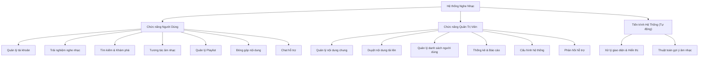
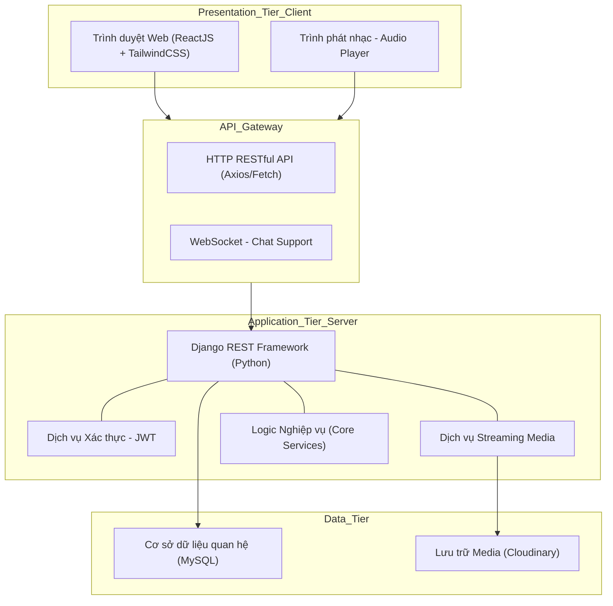
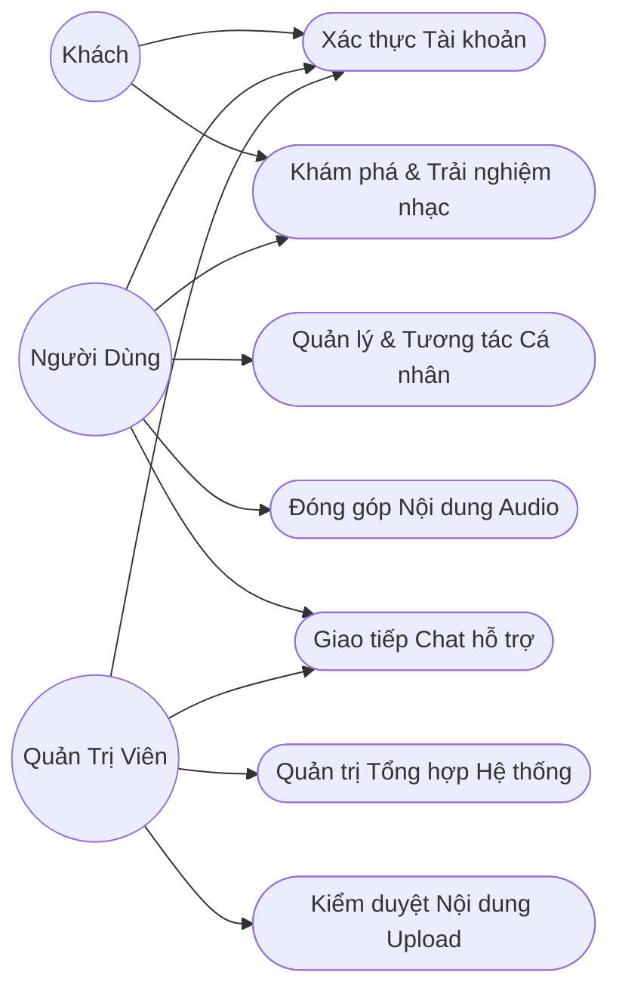
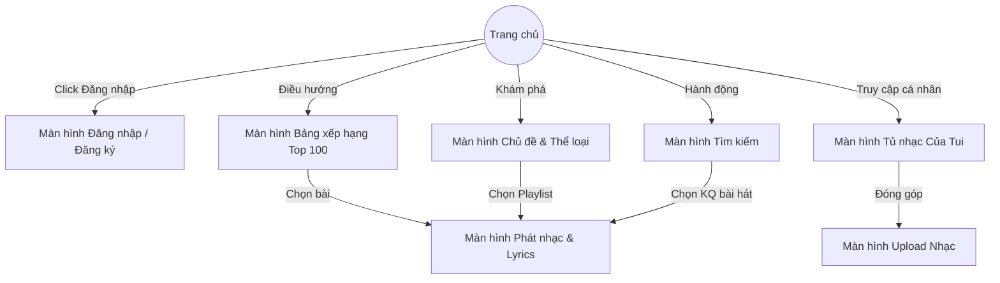
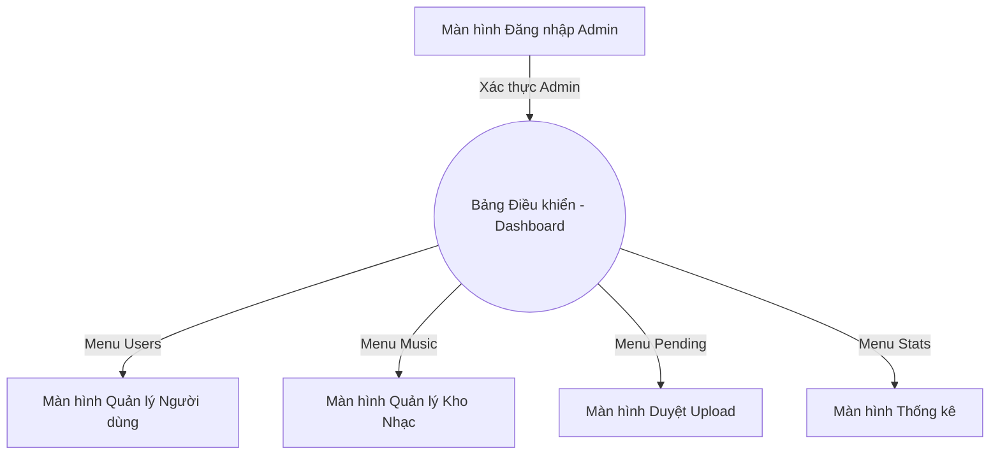

### File SRS

##### MỤC LỤC

###### I. Giới thiệu

    1.1 Tóm tắt dự án.

    1.2 Phạm vi của dự án.

    1.3 Quy ước về tài liệu.

###### II. Mô tả tổng quan.

    2.1. Quan điểm về sản phẩm.

    2.2 Đặc trưng của sản phẩm.

    2.3 Người dùng và đặc trưng.

    2.4 Yêu cầu của người dùng.

    2.5 Kiến trúc tổng quan của phần mềm.

    2.6 Sơ đồ Usecase.

    2.7 Luồng màn hình (Screen flow)

    2.8 Các yêu cầu khác của hệ thống

---

## I. Giới thiệu

### 1.1 Tóm tắt dự án

Web nghe nhạc được xây dựng nhằm mục đích mang đến cho người dùng một nền tảng giải trí âm nhạc trực tuyến tiện lợi, nơi họ có thể khám phá, thưởng thức và chia sẻ những bài hát yêu thích mọi lúc, mọi nơi.

Chúng tôi cam kết mang lại một trải nghiệm âm nhạc chất lượng cao, thân thiện và dễ sử dụng, nơi người dùng có thể:

* **Khám phá âm nhạc đa dạng:**

  Tìm kiếm và thưởng thức hàng triệu bài hát thuộc nhiều thể loại khác nhau, từ nhạc trẻ, pop, rock đến EDM và nhạc quốc tế.
* **Trải nghiệm nghe nhạc chất lượng:**

  Cung cấp âm thanh chất lượng cao, giao diện trực quan và khả năng phát nhạc mượt mà trên nhiều thiết bị.
* **Tạo và chia sẻ playlist cá nhân:**

  Người dùng có thể tự tạo danh sách phát theo sở thích và chia sẻ với bạn bè hoặc cộng đồng.
* **Cá nhân hóa trải nghiệm:**

  Ứng dụng trí tuệ nhân tạo và thuật toán gợi ý để đề xuất những bài hát, nghệ sĩ và playlist phù hợp với gu âm nhạc của từng người.
* **Kết nối cộng đồng yêu nhạc:**

Cho phép người dùng tương tác, bình luận và theo dõi nghệ sĩ hoặc người dùng khác để mở rộng trải nghiệm âm nhạc.

Với mục tiêu này, chúng tôi mong muốn trở thành nền tảng âm nhạc trực tuyến hàng đầu, giúp bạn tận hưởng và khám phá thế giới âm nhạc theo cách riêng của mình.

### 1.2 Phạm vi của dự án

**Phạm vi về dịch vụ:**

**Dashboard**

* Thống kê số lượng người dùng, lượt nghe, bài hát phổ biến
* Theo dõi hoạt động hệ thống và hiệu suất

**Quản lý người dùng**

* Quản lý tài khoản, phân quyền người dùng và admin
* Xử lý báo cáo, khóa tài khoản vi phạm

**Quản lý nội dung (Music Management)**

* Quản lý bài hát, album, nghệ sĩ
* Upload, chỉnh sửa, xóa nội dung âm nhạc
* Kiểm duyệt nội dung trước khi hiển thị

---

**Xác thực (Auth)**

* Cho phép người dùng đăng ký, đăng nhập, quên mật khẩu và đăng xuất
* Sử dụng JSON Web Token (JWT) để xác thực
* Xác minh tài khoản qua email

---

**Nghe nhạc (Music Streaming)**

* Phát nhạc trực tuyến với chất lượng cao
* Hỗ trợ phát nhạc nền, tua, lặp, shuffle
* Tối ưu trải nghiệm nghe trên nhiều thiết bị

---

**Gợi ý nhạc (Recommendation)**

* Thuật toán đề xuất dựa trên lịch sử nghe, sở thích và hành vi
* Gợi ý playlist, bài hát, nghệ sĩ phù hợp
* Hiển thị “Trending”, “Top chart”, “For you”

---

**Playlist (Danh sách phát)**

* Cho phép người dùng tạo, chỉnh sửa và xóa playlist cá nhân
* Thêm/xóa bài hát vào playlist
* Chia sẻ playlist với người khác

---

**Tìm kiếm (Search)**

* Tìm kiếm bài hát, nghệ sĩ, album
* Bộ lọc theo thể loại, xu hướng, độ phổ biến
* Gợi ý thông minh khi nhập từ khóa

---

**Hồ sơ cá nhân (Profile)**

* Cập nhật thông tin cá nhân, ảnh đại diện
* Hiển thị playlist, bài hát yêu thích
* Theo dõi nghệ sĩ hoặc người dùng khác

---

**Tương tác (Interaction)**

* Like, yêu thích bài hát
* Bình luận dưới bài hát hoặc playlist
* Chia sẻ bài hát lên mạng xã hội

---

**Phạm vi về khách hàng:**

* Người dùng cá nhân có nhu cầu nghe nhạc, giải trí
* Quản trị viên hệ thống (admin) quản lý nội dung và người dùng

**Phạm vi về nền tảng**

**Frontend:**

* Ngôn ngữ/Thư viện: ReactJS
* CSS Framework: Tailwind CSS
* HTTP Client: Axios
* Realtime: WebSocket

**Backend:**

* Ngôn ngữ: Python
* Framework: Django
* API: Django REST Framework (RESTful API)
* Xác thực: JWT (JSON Web Token)
* Realtime: WebSocket (Django Channels)

**Cơ sở dữ liệu:**

* Hệ quản trị CSDL: MySQL
* ORM: Django ORM

**Lưu trữ:**

* Media Storage: Cloudinary(audio, image)

### 1.3 Quy ước về tài liệu

Tài liệu được soạn thảo theo định dạng:

* Phông chữ: Times New Roman, cỡ chữ 12pt.
* Tuân theo chuẩn **IEEE** SRS (Software Requirements Specification).
* Các tiêu đề được bôi đậm để dễ phân biệt giữa các phần nội dung.

## II. Mô tả tổng quan

### 2.1 Quan điểm về sản phẩm

Website nghe nhạc là một sản phẩm phần mềm web được phát triển trong khuôn khổ học phần, nhằm xây dựng một nền tảng nghe nhạc trực tuyến cho phép người dùng tìm kiếm, thưởng thức và quản lý nội dung âm nhạc một cách thuận tiện.

Sản phẩm được xây dựng  **từ đầu về mặt kỹ thuật (from scratch)** , không kế thừa mã nguồn có sẵn, nhưng **tham khảo mô hình và chức năng** từ các nền tảng nghe nhạc phổ biến như **Nhaccuatui**, **Zing MP3** và **Spotify**.

Hệ thống hướng tới:

* **Cung cấp nền tảng nghe nhạc trực tuyến tiện lợi** , cho phép người dùng truy cập và thưởng thức âm nhạc mọi lúc, mọi nơi.
* **Cá nhân hóa trải nghiệm người dùng** , thông qua việc đề xuất bài hát, playlist dựa trên hành vi và sở thích.
* **Đảm bảo tính ổn định và bảo mật** , với cơ chế xác thực tài khoản, mã hóa dữ liệu và quản lý truy cập.
* **Xây dựng hệ thống dễ mở rộng** , phục vụ cho việc nâng cấp và tích hợp trong tương lai.

Hiện tại, hệ thống hoạt động độc lập. Tuy nhiên, kiến trúc RESTful API được thiết kế linh hoạt, cho phép tích hợp với:

* Ứng dụng mobile sử dụng chung backend
* Hệ thống lưu trữ và phân phối media (CDN, streaming server)
* Hệ thống thanh toán (cho tài khoản premium nếu mở rộng)

### 2.2 Đặc trưng của sản phẩm

Bảng: Các tính năng chính của Website nghe nhạc

| #  | Nhóm Tính Năng       | Mô Tả Ngắn                     | Tác Nhân | Ưu Tiên   | Phiên Bản |
| -- | ----------------------- | --------------------------------- | ---------- | ----------- | ----------- |
| 1  | Đăng ký/Đăng nhập | Email/Google, xác thực OTP      | User       | Cao         | 1.0         |
| 2  | Hồ sơ cá nhân       | Cập nhật thông tin, avatar     | User       | Cao         | 1.0         |
| 3  | Nghe nhạc              | Phát nhạc, tua, shuffle, repeat | User       | Cao         | 1.0         |
| 4  | Playlist                | Tạo, sửa, xóa playlist         | User       | Cao         | 1.0         |
| 5  | Yêu thích             | Like/lưu bài hát               | User       | Cao         | 1.0         |
| 6  | Bình luận             | Comment bài hát                 | User       | Trung bình | 1.1         |
| 7  | Tìm kiếm              | Tìm bài hát, nghệ sĩ, album  | User       | Cao         | 1.0         |
| 8  | Gợi ý nhạc           | Đề xuất theo hành vi          | User       | Cao         | 1.0         |
| 9  | Quản lý nội dung     | CRUD bài hát, album             | Admin      | Cao         | 1.0         |
| 10 | Upload nhạc            | Thêm nội dung mới              | Admin      | Cao         | 1.0         |
| 11 | Quên mật khẩu        | Reset qua email                   | User       | Cao         | 1.0         |
| 12 | Thống kê              | Lượt nghe, người dùng        | Admin      | Trung bình | 1.1         |
| 13 | Quản lý tài khoản   | Khoá/mở user                    | Admin      | Cao         | 1.0         |
| 14 | Thông báo             | Bài mới, playlist               | User       | Trung bình | 1.1         |
| 15 | Báo cáo nội dung     | Báo cáo vi phạm                | User       | Trung bình | 1.1         |

Ma trận tính năng theo người dùng

| Tính năng               | User | Admin |
| ------------------------- | ---- | ----- |
| Đăng ký / Đăng nhập | ✓   | ✓    |
| Google login              | ✓   | ✗    |
| Xác minh email           | ✓   | ✗    |
| Quên mật khẩu          | ✓   | ✗    |
| Hồ sơ cá nhân         | ✓   | ✗    |
| Nghe nhạc                | ✓   | ✗    |
| Playlist                  | ✓   | ✗    |
| Like bài hát            | ✓   | ✗    |
| Bình luận               | ✓   | ✗    |
| Tìm kiếm                | ✓   | ✓    |
| Gợi ý nhạc             | ✓   | ✗    |
| Thông báo               | ✓   | ✗    |
| Báo cáo nội dung       | ✓   | ✗    |
| Quản lý user            | ✗   | ✓    |
| Quản lý nhạc           | ✗   | ✓    |
| Upload nhạc              | ✗   | ✓    |
| Thống kê                | ✗   | ✓    |

### 2.3 Người dùng và đặc trưng

Hệ thống phục vụ hai nhóm chính:

**Người dùng (User)**

* Là người sử dụng hệ thống để nghe nhạc, tìm kiếm và quản lý nội dung cá nhân
* Mục tiêu: giải trí, khám phá âm nhạc
* Yêu cầu: giao diện đơn giản, dễ dùng, chạy mượt

**Quản trị viên (Admin)**

* Là người vận hành hệ thống
* Mục tiêu: quản lý nội dung, người dùng, đảm bảo hệ thống ổn định
* Yêu cầu: phân quyền rõ ràng, bảo mật cao

**Bảng đặc trưng người dùng**

| Vai trò        | Mô tả                   | Mục tiêu   | Yêu cầu | Tần suất        |
| --------------- | ------------------------- | ------------ | --------- | ----------------- |
| **User**  | Nghe nhạc, tạo playlist | Giải trí   | Dễ dùng | Cao               |
| **Admin** | Quản lý hệ thống      | Kiểm duyệt | Bảo mật | Trung bình - cao |

**Ma trận đặc trưng kỹ thuật**

| Tiêu chí                       | User              | Admin             |
| -------------------------------- | ----------------- | ----------------- |
| **Trình độ kỹ thuất** | Thấp             | Trung bình - cao |
| **Thiết bị**             | Mobile / Desktop  | Desktop           |
| **Băng thông**           | Không ổn định | Ổn định        |
| **Đào tạo**             | Không cần       | Cơ bản          |

### 2.4 Yêu cầu của người dùng

Trong phần này, các yêu cầu của người dùng đối với hệ thống được chia thành hai nhóm chính: Yêu cầu chức năng (Functional Requirements) và Yêu cầu phi chức năng (Non-Functional Requirements).

#### 2.4.1 Yêu cầu chức năng

Dựa trên đặc trưng tương tác, hệ thống cần đáp ứng các tính năng sau:

##### A. Sơ đồ phân rã chức năng (FDD)

##### B. Mô tả chi tiết hệ thống

**1. Đối với Người dùng (User):**

- **Quản lý tài khoản:**
  - Có khả năng đăng ký, đăng nhập, đăng xuất.
  - Xem và chỉnh sửa thông tin cá nhân.
- **Trải nghiệm nghe nhạc:**
  - Chọn phát / dừng nhạc.
  - Chọn lặp lại một bài hát, phát ngẫu nhiên, chuyển tiếp hoặc lùi bài hát.
- **Tìm kiếm & Khám phá:**
  - Tìm kiếm âm nhạc theo tên bài hát, nghệ sĩ, album hoặc playlist.
  - Xem danh sách và thông tin chi tiết bài hát, nghệ sĩ, album, playlist.
- **Tương tác âm nhạc:**
  - Có thể thích (like) hoặc báo cáo (report) bài hát.
  - Xem lại lịch sử nghe nhạc.
- **Quản lý Playlist (Danh sách phát):**
  - Tạo mới, chỉnh sửa tên, xóa playlist.
  - Thêm hoặc xóa bài hát khỏi playlist.
- **Đóng góp nội dung (Upload):**
  - Có thể tải lên (upload) bài nhạc
  - Chỉnh sửa hoặc xóa thông tin bài hát, album, playlist mà mình đã đóng góp.
- **Hỗ trợ:**
  - Nhận được sự hướng dẫn, hỗ trợ thông qua tính năng chat.

**2. Đối với Quản trị viên (Admin):**

- **Quản lý và Duyệt nội dung:**
  - Duyệt hoặc từ chối các bài hát, album, playlist do người dùng tải lên
  - Có thể thêm, sửa, xóa các bài hát, album, playlist vào hệ thống chung.
- **Quản lý Người dùng:**
  - Xem danh sách người dùng
  - Khóa / mở khóa hoặc xóa tài khoản khi cần thiết.
- **Thống kê và Báo cáo:**
  - Xem thống kê hệ thống bao gồm lượt nghe, các bài hát thịnh hành, tổng số lượng người dùng.
- **Cấu hình hệ thống:**
  - Quản lý phân quyền, thực hiện các cài đặt chung cho hệ thống.
- **Hỗ trợ khách hàng:**
  - Trả lời, hỗ trợ người dùng và giải quyết thắc mắc, báo cáo qua tính năng chat.

**3. Các tiến trình tự động của hệ thống (System Processes):**

- **Xử lý và hiển thị thông tin:** Phản hồi truy vấn, phân phát dữ liệu bài hát, album, playlist, nghệ sĩ và hiển thị trực quan đến giao diện người dùng.
- **Thuật toán thông minh:** Tự động phân tích, tính toán và gợi ý các bài hát phù hợp dựa trên chủ đề, xu hướng hoặc thói quen cá nhân hóa của người dùng.

##### C. Bảng mô tả yêu cầu chức năng

| Mã YC | Tên chức năng / Yêu cầu        | Tác nhân                                   | Mô tả chi tiết chức năng                                                          |
| :----- | :---------------------------------- | :------------------------------------------- | :------------------------------------------------------------------------------------- |
| FR01   | Quản lý tài khoản               | Người dùng                                | Đăng ký, đăng nhập, đăng xuất, xem và chỉnh sửa thông tin cá nhân.      |
| FR02   | Điều khiển phát nhạc           | Người dùng                                | Phát, dừng nhạc, lặp lại, phát ngẫu nhiên, chuyển tiếp, lùi bài.           |
| FR03   | Tìm kiếm và khám phá bài hát | Người dùng                                | Tìm kiếm bài hát theo chủ đề, nghệ sĩ, album, playlist.                       |
| FR04   | Tương tác bài hát              | Người dùng                                | Thích, báo cáo bài hát. Xem lại lịch sử nghe nhạc.                            |
| FR05   | Quản lý Playlist                  | Người dùng                                | Tạo, sửa tên, xóa playlist. Thêm, sửa, xóa bài hát khỏi playlist.            |
| FR06   | Upload âm nhạc                    | Người dùng                                | Tải lên bài hát mới, chỉnh sửa, xóa thông tin bài do mình đóng góp.      |
| FR07   | Xem thông tin và điều hướng   | Người dùng                                | Cập nhật và xem thông tin bài hát, danh sách, nghệ sĩ đầy đủ, dễ chịu. |
| FR08   | Nhận gợi ý nhạc tự động      | Người dùng (Tiến trình hệ thống cấp) | Cập nhật đề xuất bài nhạc theo sự kiện xu hướng hoặc thói quen nghe.      |
| FR09   | Chat và nhận hỗ trợ             | Người dùng                                | Tương tác trực tiếp qua chat để báo cáo lỗi hoặc nhận hướng dẫn.        |
| FR10   | Quản lý nội dung chung           | Quản trị viên                             | Thêm, sửa, xóa bài gốc, album, playlist vào dữ liệu của hệ thống.           |
| FR11   | Duyệt nội dung Upload             | Quản trị viên                             | Tiền duyệt hoặc từ chối các bài nhạc do tài khoản User đóng góp.          |
| FR12   | Quản lý người dùng             | Quản trị viên                             | Xem danh sách tổng quan, khóa hoặc mở khóa tài khoản vi phạm.                 |
| FR13   | Thống kê số liệu                | Quản trị viên                             | Xem top bài hát, lượt stream, và số lượng User mới đăng ký.                |
| FR14   | Cấu hình hệ thống               | Quản trị viên                             | Phân quyền tính năng, giới hạn nội dung, cài đặt server gốc.                |
| FR15   | Hướng dẫn hỗ trợ               | Quản trị viên                             | Nhận tin nhắn chat, phản hồi thắc mắc, giải quyết các báo cáo vi phạm.     |

#### 2.4.2 Yêu cầu phi chức năng

Bên cạnh các yếu tố chức năng, hệ thống cần đảm bảo những tiêu chí về chất lượng dịch vụ sau đây:

- **Tính khả dụng (Usability):**
  - Giao diện của trang web cần thân thiện, hiện đại, dễ thao tác sử dụng, phù hợp hiển thị trên Desktop.
- **Tính hiệu năng (Performance):**
  - Hệ thống tải trang và tải dữ liệu (đặc biệt là streaming nhạc) nhanh chóng, mượt mà, độ trễ thấp để đem lại trải nghiệm nghe nhạc không bị giật lag (buffer).
  - Khả năng xử lý đồng thời số lượng truy cập lớn mà vẫn duy trì ổn định.
- **Tính bảo mật (Security):**
  - Mã hóa mật khẩu và các thông tin dữ liệu nhạy cảm của người dùng.
  - Xác thực và phân quyền đúng đối tượng (chỉ admin mới có quyền truy cập trang quản trị và thao tác dữ liệu dùng chung).
  - Phòng chống các cuộc tấn công phổ biến trên web như SQL Injection, XSS, DDoS.
- **Tính độ tin cậy (Reliability & Availability):**
  - Hệ thống phải hoạt động ổn định 24/7, tỷ lệ sẵn sàng cao,
  - Sao lưu dữ liệu thường xuyên để hạn chế rủi ro mất mát dữ liệu,
  - Thiết kế hạn chế thời gian downtime ở mức tối thiểu.
- **Tính mở rộng (Scalability):**
  - Mã nguồn hệ thống và cơ sở dữ liệu phải được thiết kế tốt (clean architecture)
  - Dễ dàng mở rộng tính năng và nâng cấp server khi hệ thống tăng trưởng về lượng bài hát lẫn lượng CCU lớn trong tương lai.

---

### 2.5 Kiến trúc tổng quan của phần mềm

Hệ thống Website Nghe Nhạc Trực Tuyến được thiết kế dựa trên mô hình kiến trúc **Client - Server (Khách - Chủ)** kết hợp kết cấu phân tầng (3-Tier Architecture), nhằm đảm bảo tính độc lập, dễ bảo trì và khả năng mở rộng linh hoạt. Việc lựa chọn kiến trúc này cho phép nhóm phát triển độc lập và chuyên sâu vào từng phần của hệ thống.

#### 2.5.1 Sơ đồ Kiến trúc Tổng quan

#### 2.5.2 Mô tả chi tiết các tầng kiến trúc

**a. Tầng Giao diện (Presentation Tier / Client):**
Tầng này chịu trách nhiệm hiển thị và tương tác trực tiếp với người dùng cuối, được xây dựng bằng thư viện **ReactJS** kết hợp framework styling **TailwindCSS**.

- **Đặc điểm kiến trúc:** Xây dựng dưới dạng Single Page Application (SPA).
- **Chức năng chính:**
  - Đóng vai trò là điểm tiếp xúc trực tiếp với người dùng và quản trị viên trên trình duyệt web (Desktop/Mobile).
  - Sử dụng **React Components** kết hợp tiện ích của **TailwindCSS** để xây dựng giao diện đồ họa đẹp mắt, chuẩn UI/UX và hoàn toàn linh hoạt (Responsive) cho cả Web Player và Admin Dashboard.
  - Quản lý trạng thái ứng dụng (State Management): Đảm bảo trình phát nhạc (Audio Player) hoạt động liên tục (Persistent Player), không bị ngắt quãng khi người dùng chuyển đổi giữa các trang chức năng.
  - Giao tiếp với Server thông qua các yêu cầu HTTP (API Requests) bằng Axios hoặc Fetch API, tiếp nhận luồng stream dữ liệu tốc độ cao.

**b. Tầng Ứng dụng & Xử lý (Application Tier / Server):**
Đóng vai trò là trung tâm xử lý nghiệp vụ, nhận và phân giải các yêu cầu, được xây dựng dựa trên framework **Django (Python)**.

- **Đặc điểm kiến trúc:** Sử dụng **Django REST Framework (DRF)** để cung cấp các API chuẩn RESTful kết hợp giao tiếp thời gian thực **WebSocket** (đối với tính năng chat).
- **Chức năng chính:**
  - **Xử lý nghiệp vụ (Business Logic):** Thực hiện thuật toán tìm kiếm, phân tích xu hướng nghe nhạc, quản trị nội dung và xử lý tương tác (Like, tạo Playlist, duyệt bài hát).
  - **Xác thực và Bảo mật:** Kiểm tra và quản lý định danh người dùng qua cơ chế **JWT (JSON Web Token)**, đảm bảo phân quyền chặt chẽ giữa User thông thường và Admin.
  - **Tích hợp Media:** Điều phối tải lên/tải về và truyền tải file âm thanh (Streaming) xuống trực tiếp cho Client sử dụng thay vì buộc thiết bị tải cục bộ.
  - **Quản trị hệ thống:** Xây dựng giao diện quản trị nhanh chóng để kiểm soát dữ liệu dựa trên tính năng **Django Admin**.

**c. Tầng Cơ sở dữ liệu & Lưu trữ (Data Tier):**
Chịu trách nhiệm lưu trữ an toàn, tin cậy dữ liệu của hệ thống, chia làm 2 kho dữ liệu chuyên biệt để tối ưu dữ liệu và băng thông:

- **Hệ quản trị CSDL quan hệ (MySQL):**
  - Ghi nhận và lưu trữ cấu trúc metadata văn bản: thông tin tài khoản người dùng, chi tiết bài hát (tên, ca sĩ, album, thể loại), lời bài, quan hệ giữa playlist và bài hát.
  - Sử dụng **Django ORM** để quản lý, truy xuất dữ liệu an toàn, phòng ngừa lỗi SQL Injection.
- **Dịch vụ lưu trữ Media chuyên dụng (Cloudinary):**
  - Kho lưu trữ vật lý đám mây (Object Storage) chứa các tệp tin phi cấu trúc có dung lượng lớn như file âm thanh (.mp3, .m4a) và hình ảnh (avatar, ảnh bìa nghệ sĩ, album).
  - Giải phóng áp lực băng thông máy chủ chính, cung cấp URL bảo mật cho ReactJS truy xuất nạp thẳng vào Audio Player.

#### 2.5.3 Luồng tương tác tiêu biểu của hệ thống (System Interaction Flow)

1. **Gửi yêu cầu:** Người dùng nhấn nút "Phát nhạc" trên giao diện **ReactJS**. Client gửi HTTP Request API chứa mã bài hát (Song ID) và Token người dùng (nếu có) tới **Django Server**.
2. **Xác thực & Xử lý:** Django tiếp nhận, xác minh quyền truy cập thông qua **JWT**. Nếu hợp lệ, chuyển qua xử lý logic truy vấn bài hát trong **MySQL** bằng ORM.
3. **Truy xuất dữ liệu:** Server lấy URL nguồn của file audio được lưu trữ bên phía **Cloudinary**, kết hợp các metadata (tên bài, tác giả, ảnh bìa) từ cơ sở dữ liệu.
4. **Phản hồi:** Server đóng gói dữ liệu thành chuẩn JSON và trả tín hiệu (Response) về cho API Gateway phía Client.
5. **Thực thi hiển thị:** ReactJS nhận thông tin từ JSON, vẽ ảnh bìa lên giao diện, nạp URL nhạc vào thẻ đối tượng Audio Player và thực thi phát âm thanh cho người dùng.

---

### 2.6 Sơ đồ Usecase và Đặc tả Usecase

#### 2.6.1 Sơ đồ Usecase

**a. Tác nhân**

| Bậc | Tên tác nhân          | Mô tả vai trò                                                                                                                                                |
| :--- | :----------------------- | :-------------------------------------------------------------------------------------------------------------------------------------------------------------- |
| 1    | Khách (Guest)           | Người truy cập vãng lai, chưa có tài khoản hoặc chưa đăng nhập. Có quyền hạn trải nghiệm âm nhạc mức cơ bản.                             |
| 2    | Người dùng (User)     | Thính giả đã có tài khoản trên hệ thống, được sử dụng các tính năng cá nhân hóa như tạo Playlist, thích bài hát và Upload nội dung. |
| 3    | Quản trị viên (Admin) | Người điều hành hệ thống, có thẩm quyền cao nhất để kiểm duyệt nội dung, quản lý người dùng và theo dõi thống kê.                      |

**b. Danh sách Usecase**

| Mã UC | Tên Usecase                       | Tác nhân chính  |
| :----- | :--------------------------------- | :----------------- |
| UC1    | Xác thực Tài khoản             | Guest, User, Admin |
| UC2    | Khám phá & Trải nghiệm nhạc   | Guest, User        |
| UC3    | Quản lý & Tương tác Cá nhân | User               |
| UC4    | Đóng góp Nội dung Audio        | User               |
| UC5    | Quản trị Tổng hợp Hệ thống   | Admin              |
| UC6    | Kiểm duyệt Nội dung Upload      | Admin              |
| UC7    | Giao tiếp Chat hỗ trợ           | User, Admin        |

**c. Sơ đồ Usecase**

#### 2.6.2 Đặc tả Usecase

*Dưới đây là đặc tả chi tiết cho các Use case cốt lõi của hệ thống nghe nhạc trực tuyến.*

**1. UC1: Xác thực Tài khoản (Đăng ký / Đăng nhập)**

* **a. Mô tả và mức độ ưu tiên:**
  * **Mô tả:** Chức năng cho phép người dùng đăng ký, đăng nhập và đăng xuất khỏi hệ thống để sử dụng các tiện ích mang tính cá nhân hóa. Quản trị viên sử dụng để truy cập bảng điều khiển.
  * **Mức độ ưu tiên:** Cao (High)
* **b. Chuỗi kích thích/phản hồi:**| Kích thích (Guest/User/Admin)                     | Phản hồi (Hệ thống)                                       |
  | :-------------------------------------------------- | :------------------------------------------------------------ |
  | Chọn chức năng "Đăng ký" hoặc "Đăng nhập" | Hiện Form yêu cầu thông tin đăng nhập/đăng ký       |
  | Điền tên tài khoản, mật khẩu và Submit      | Kiểm tra thông tin trong Cơ sở dữ liệu                  |
  | *(Trường hợp tài khoản hợp lệ)*            | Cấp thẻ JWT và định tuyến sang trang User/Admin         |
  | *(Trường hợp sai thông tin)*                  | Hiển thị thông báo rủi ro xác thực không thành công |
* **c. Yêu cầu chức năng:**
  * Hệ thống phải có khả năng băm (hash) mật khẩu để bảo vệ an toàn dữ liệu.
  * Tính năng cấp lại mật khẩu qua email nếu người dùng quên mật khẩu.

**2. UC2: Khám phá & Trải nghiệm nhạc (Search & Stream)**

* **a. Mô tả và mức độ ưu tiên:**
  * **Mô tả:** Chức năng trọng tâm của website, cho phép tra cứu bài hát, ca sĩ và sử dụng Audio Player để phát âm thanh mà không cần tải file về.
  * **Mức độ ưu tiên:** Rất Cao (Critical)
* **b. Chuỗi kích thích/phản hồi:**| Kích thích (Guest/User)            | Phản hồi (Hệ thống)                                                |
  | :----------------------------------- | :--------------------------------------------------------------------- |
  | Gõ từ khóa vào thanh Tìm kiếm  | Truy vấn CSDL và hiển thị danh sách kết quả bài hát/ca sĩ    |
  | Nhấp Play một bản nhạc           | Trả về Audio URL để bắt đầu trình chiếu bản nhạc (Stream)   |
  | Nhấn dừng (Pause) hoặc tua (Seek) | Ngừng hoặc điều chỉnh bộ đếm thời gian âm thanh tương ứng |
* **c. Yêu cầu chức năng:**
  * Thuật toán tìm kiếm hỗ trợ tìm kiếm linh hoạt tên bài hát, nghệ sĩ.
  * Phản hồi luồng Stream âm nhạc với độ trễ thấp đảm bảo nghe mượt, không gián đoạn.

**3. UC3: Quản lý & Tương tác Cá nhân (Playlist, Like)**

* **a. Mô tả và mức độ ưu tiên:**
  * **Mô tả:** Nhóm chức năng xử lý tương tác của người dùng với các bài nhạc (Like, tạo Playlist cá nhân) và thiết lập tài khoản.
  * **Mức độ ưu tiên:** Trung bình (Medium)
* **b. Chuỗi kích thích/phản hồi:**| Kích thích (User)                          | Phản hồi (Hệ thống)                                                      |
  | :------------------------------------------- | :--------------------------------------------------------------------------- |
  | Bấm biểu tượng Yêu thích (Trái tim)   | Lưu Record vào database và bôi đỏ nút tim                             |
  | Bấm "Tạo Playlist mới"                    | Trả về khung nhập tên Playlist và tạo Playlist trống                  |
  | Bấm "Thêm vào Playlist" trên 1 bài hát | Ánh xạ ID bản nhạc vào Playlist đó và hiện thông báo thành công |
* **c. Yêu cầu chức năng:**
  * Dữ liệu thư viện cá nhân của tài khoản này độc lập, không bị tài khoản khác thao tác thay đổi.
  * Có giao diện Thư viện giúp theo dõi tất cả Playlist đã lưu.

**4. UC4: Đóng góp Nội dung Audio (Upload)**

* **a. Mô tả và mức độ ưu tiên:**
  * **Mô tả:** Người dùng chủ động chia sẻ nội dung sản phẩm nghệ thuật (Cover, Remix, Sáng tác mới) với cộng đồng qua form tải tệp âm thanh.
  * **Mức độ ưu tiên:** Cao (High)
* **b. Chuỗi kích thích/phản hồi:**| Kích thích (User)                  | Phản hồi (Hệ thống)                                           |
  | :----------------------------------- | :---------------------------------------------------------------- |
  | Chọn mục Upload bài hát          | Cung cấp UI Form cần điền Metada và nút tải file MP3       |
  | Tải file xong và bấm "Xác nhận" | Đẩy Audio lên lưu trữ Đám mây (Cloud Storage)             |
  | *(Quá trình chờ xử lý)*       | Ghi nhận bài hát ở trạng thái "Đang chờ duyệt" (Pending) |
* **c. Yêu cầu chức năng:**
  * Giới hạn về dung lượng và định dạng tải lên cho phép (Max 15MB, chấp nhận định dạng âm thanh chuẩn).
  * Không đưa bài hát mới vào kết quả tìm kiếm cộng đồng khi Admin chưa có quyết định công khai (Approved).

**5. UC6: Kiểm duyệt Nội dung Upload**

* **a. Mô tả và mức độ ưu tiên:**
  * **Mô tả:** Công đoạn hậu kiểm của Admin nhằm đảm bảo kho nhạc cộng đồng tuân thủ bản quyền âm nhạc.
  * **Mức độ ưu tiên:** Cao (High)
* **b. Chuỗi kích thích/phản hồi:**| Kích thích (Admin)                        | Phản hồi (Hệ thống)                                                      |
  | :------------------------------------------ | :--------------------------------------------------------------------------- |
  | Vào mục "Danh sách Chờ kiểm duyệt"    | Truy xuất và tải bảng dữ liệu những bài Upload Pending               |
  | Nhấn chức năng "Nghe thử"               | Khởi động Player nội tuyến để phát thử file gốc                    |
  | Bấm nút "Phê duyệt" (Approve)           | Chuyển bài hát thành trạng thái Công khai (Public) và báo tác giả |
  | Bấm nút "Từ chối" (Reject) + ghi lý do | Trả vể trạng thái Không hợp lệ và gửi lý do cho tác giả          |
* **c. Yêu cầu chức năng:**
  * Chặn hoàn toàn User bình thường can thiệp vào trang kiểm duyệt này.
  * Lưu trữ được lịch sử nhật ký (Logs) để tra soát Admin nào đã duyệt bài hát nào.

---

### 2.7 Luồng màn hình (Screen flow)

#### 2.7.1 Sơ đồ luồng màn hình

**a. Sơ đồ luồng màn hình dành cho Khách/Người dùng (Guest/User)**

**b. Sơ đồ luồng màn hình dành cho Quản trị viên (Admin)**

#### 2.7.2 Mô tả màn hình

| STT | Màn hình                      | Mô tả                                                                                                                                                      |
| :-: | :------------------------------ | :----------------------------------------------------------------------------------------------------------------------------------------------------------- |
|  1  | Trang chủ                      | Lấy cảm hứng từ NhacCuaTui, trang sở hữu banner động, danh mục "Hôm nay nghe gì", "Nhạc mới", kèm trình phát mini-player ở viền.           |
|  2  | Đăng nhập / Đăng ký       | Quản lý form thu thập thông tin định danh của người dùng để cấp quyền truy cập các tính năng cá nhân hóa.                               |
|  3  | Tìm kiếm                      | Ô tìm kiếm hỗ trợ tra cứu trực tiếp theo thời gian thực (Live-search), kết quả phân loại thành: Ca sĩ, Bài hát, Playlist.                  |
|  4  | Bảng xếp hạng Top 100        | Bảng xếp hạng cập nhật theo thời gian, chia theo thị trường âm nhạc (Việt Nam, Âu Mỹ, Hàn Quốc) lấy dữ liệu dựa vào lượt nghe/thích. |
|  5  | Chủ đề & Thể loại          | Trình bày dạng danh mục lưới nhằm hướng người dùng chọn nhạc theo trạng thái (Buồn, Chill, Acoustic) hoặc nhịp độ (EDM, Rap).           |
|  6  | Phát nhạc & Lyrics            | Màn hình trung tâm để nghe nhạc. Bao gồm đĩa nhạc xoay tròn, thanh chức năng Timeline và chạy lời nhạc Karaoke đồng bộ.                  |
|  7  | Tủ nhạc Của Tui              | Nơi cá nhân hóa lưu lại tự động: Bài hát thường nghe, Playlist tự tạo nội bộ để dễ dàng tìm kiếm lại những bản nhạc yêu thích.  |
|  8  | Upload Nhạc                    | Màn hình chứa Form biểu mẫu tải file Audio đa phương tiện (.mp3) đi kèm trường dữ liệu Metadata để đăng lên cộng đồng.               |
|  9  | Đăng nhập Admin              | Giao diện đăng nhập bảo mật tách biệt hoàn toàn dành riêng cho đội ngũ Quản trị viên vận hành hệ thống.                                |
| 10 | Bảng Điều khiển - Dashboard | Màn hình tổng quan CMS tập trung trình bày nhanh các thông số chỉ báo tài nguyên và truy cập thời gian thực trên hệ thống.               |
| 11 | Quản lý Người dùng         | Màn hình dạng bảng lưới giúp Admin tra soát, khóa quyền truy cập của các tài khoản thành viên vi phạm quy tắc nền tảng.                 |
| 12 | Quản lý Kho Nhạc             | Quản trị nguồn Database của hệ thống, nơi Admin có quyền Sửa/Xóa Media file do user tải lên bị sai lệch thông tin bản quyền.               |
| 13 | Duyệt Upload                   | Màn hình cung cấp công cụ nghe thử để Admin trực tiếp thẩm định qua file Audio đang trong trạng thái Pending do người dùng gửi lên.     |
| 14 | Thống kê                      | Màn hình báo cáo trực quan với biểu đồ (Pie/Bar Chart) theo dõi xu hướng thể loại nhạc thịnh hành nhất của tháng/năm.                   |

#### 2.7.3 Các chức năng không liên quan đến màn hình

| STT | Chức năng hệ thống      | Mô tả (Cấu hình chạy ngầm / Tiện ích)                                                                                                                           |
| :-: | :-------------------------- | :---------------------------------------------------------------------------------------------------------------------------------------------------------------------- |
|  1  | Phát nhạc nền liên tục | Khi chuyển đổi giữa trang chủ sang trang tìm kiếm hay cá nhân, luồng Audio vẫn liên tục phát ẩn bên dưới để âm thanh không bị gián đoạn.      |
|  2  | Cron Job cập nhật Ranking | Chức năng chạy ngầm (ví dụ: mỗi đêm) tiến hành tổng hợp cơ dữ liệu để tự động xếp hạng Trending Song dựa trên số lượt Listen + Like.        |
|  3  | Sinh JWT Token              | Máy chủ tự động tạo token (JSON Web Token) để giữ phiên xác thực giữa các API Client-Server mà không cần phải hiện ra Frontend.                      |
|  4  | Stream Chunking             | Thuật toán xử lý băm nhỏ bộ nhớ byte của âm thanh từ Server truyền qua lại cho Client nhằm tối ưu băng thông lúc tải thay vì tải 1 file cục bộ. |

#### 2.7.4 Hệ thống cấp quyền

| STT | Vai trò (Role)                  | Chức năng hoạt động / Quyền hạn                                                                                                                                           |
| :-: | :------------------------------- | :------------------------------------------------------------------------------------------------------------------------------------------------------------------------------- |
|  1  | Khách vãng lai (Guest)         | Khám phá thư viện chung, nghe nhạc. Bị giới hạn các hành động thả tim, bình luận và tạo list nhạc cá nhân.                                                   |
|  2  | Người dùng (Normal User)      | Có đủ mọi quyền của Khách. Được cấp quyền tương tác (Thích/Báo cáo bài hát), thiết lập lưu trữ (Playlist, Lịch sử) và Upload file âm thanh riêng.   |
|  3  | Quản trị viên (Administrator) | Vượt rào truy cập vào khu vực CMS Dashboard. Quản lý toàn bộ master data (sửa, xóa bài nguồn), thẩm định và duyệt Upload của cộng đồng, cấm tài khoản. |

---

### 2.8 Các yêu cầu khác của hệ thống (Other Requirements)

Để đảm bảo dự án vận hành trơn tru trong môi trường thực tế, ngoài các yêu cầu về chức năng và giao diện người dùng, dự án đòi hỏi những nguyên tắc hiện đại bắt buộc về Tích hợp/Triển khai liên tục và hạ tầng DevOps.

#### 2.8.1 Yêu cầu DevOps & Triển khai (Deployment)

* **Khả năng Containerization:** Backend (Django REST) và Frontend (React) phải được đóng gói thành các image bằng **Docker**, có sẵn file `docker-compose.yml` để dễ dàng khởi tạo chỉ với một câu lệnh trên các môi trường khác nhau.
* **Môi trường Server:** Mã nguồn yêu cầu khả năng tương thích vận hành trên nền tảng máy chủ hệ điều hành Linux (như Ubuntu/CentOS) do đây là chuẩn chung của các nền tảng VPS/Cloud.
* **Quản lý Secret Key:** Các chuỗi nhạy cảm và thông tin Database mật cần được cô lập toàn bộ vô file `.env` theo nguyên tắc bảo mật. Cấm việc hardcode vào bảng mã nguồn trực tiếp.

#### 2.8.2 Yêu cầu CI/CD (Continuous Integration / Continuous Deployment)

* **Repo & Branching:** Quản lý source code thống nhất trên kho lưu trữ đám mây (GitHub/GitLab). Mỗi tác vụ nâng cấp tính năng đều phải đẩy vào nhánh phụ (`feature/`) và tạo Pull Request (PR) về nhánh chính thay vì commit đè trực tiếp.
* **Tích hợp liên tục (CI Workflow):** Hệ thống ưu tiên thiết lập Pipeline tự động chạy các bài test, hoặc các tool kiểm tra lỗi mã nguồn tĩnh ngay khi ghi nhận một tín hiệu mở PR mới.
* **Triển khai liên tục (CD Pipeline):** Khi Pull Request được nghiệm thu thành công hoặc có code merge mới vào `main`, một luồng công việc sẽ tự động pull code về môi trường Procuction, khởi động quá trình build bundle và cập nhật container không cần sự thao tác tĩnh bằng tay từ con người.
